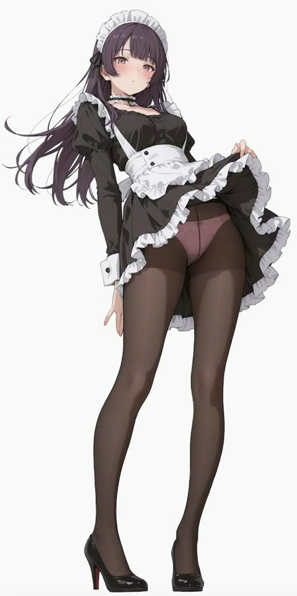
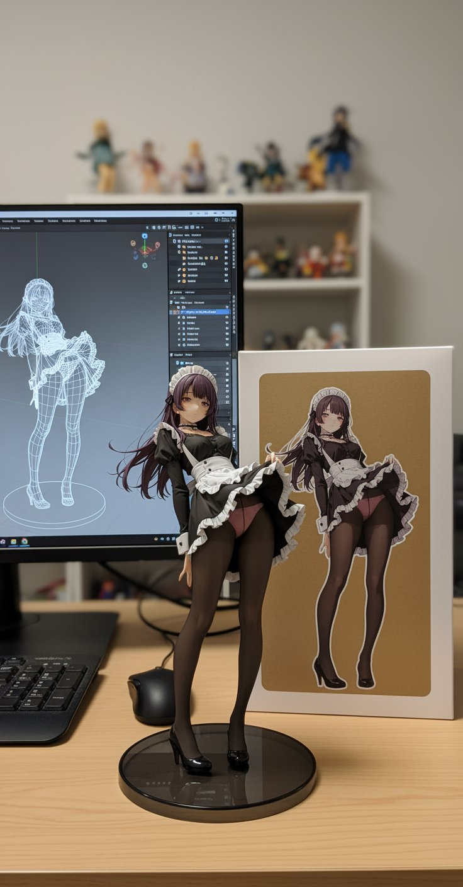

<div align="center">

# Awesome-${\color{#FF8C00}N}\color{#FF9500}a\color{#FF9E00}n\color{#FFA700}o\color{#FFB000}🍌B\color{#FFB900}a\color{#FFC200}n\color{#FFCB00}a\color{#FFD400}n\color{#FFDD00}a\color{#FFE600}$-images

</div>

## 🍌 Introduction

🤗 *欢迎来到 Nano-banana 精选图片库！*

**我们收集了Nano-banana在各个任务场景下生成的令人惊艳的图片和提示词**，全方位展示Google在图像生成与编辑的无限可能。希望能帮助你更好地了解Nano-banana。快一起解锁 Nano-banana 的多图融合与创意编辑力量吧！✨

这些案例主要来源于Twitter/ X 🐦、小红书📕等自媒体平台。

喜欢就点 ⭐ Star 收藏起来吧！

## 📑 Menu

- [Case 1: 插画变手办（by @ZHO\_ZHO\_ZHO）](#case-1-插画变手办by-zho_zho_zho)
- [Case 2: 根据地图箭头生成地面视角图片（by @tokumin）](#case-2-根据地图箭头生成地面视角图片by-tokumin)
- [Case 3: 真实世界的AR信息化（by @bilawalsidhu）](#case-3-真实世界的ar信息化by-bilawalsidhu)
- [Case 4: 分离出3D建筑/制作等距模型（by @Zieeett）](#case-4-分离出3d建筑制作等距模型by-zieeett)
- [Case 5: 不同时代自己的照片（by @AmirMushich）](#case-5-不同时代自己的照片by-amirmushich)
- [Case 6: 多参考图像生成（by @MrDavids1）](#case-6-多参考图像生成by-mrdavids1)
- [Case 7: 自动修图（by @op7418）](#case-7-自动修图by-op7418)
- [Case 8: 手绘图控制多角色姿态（by @op7418）](#case-8-手绘图控制多角色姿态by-op7418)
- [Case 9: 跨视角图像生成（by @op7418）](#case-9-跨视角图像生成by-op7418)
- [Case 10: 定制人物贴纸（by @op7418）](#case-10-定制人物贴纸by-op7418)
- [Case 11: 动漫转真人Coser（by @ZHO\_ZHO\_ZHO）](#case-11-动漫转真人coserby-zho_zho_zho)
- [Case 12: 生成角色设定（by @ZHO\_ZHO\_ZHO）](#case-12-生成角色设定by-zho_zho_zho)
- [Case 13: 色卡线稿上色（by @ZHO\_ZHO\_ZHO）](#case-13-色卡线稿上色by-zho_zho_zho)
- [Case 14: 文章信息图（by @黄建同学）](#case-14-文章信息图by-黄建同学)
- [Case 15: 更换多种发型（by @balconychy）](#case-15-更换多种发型by-balconychy)
- [Case 16: 模型标注讲解图（by @berryxia\_ai）](#case-16-模型标注讲解图by-berryxia_ai)
- [Case 17: 定制大理石雕塑（by @umesh\_ai）](#case-17-定制大理石雕塑by-umesh_ai)
- [Case 18: 根据食材做菜（by @Gdgtify）](#case-18-根据食材做菜by-gdgtify)
- [Case 19: 数学题推理（by @Gorden Sun）](#case-19-数学题推理by-gorden-sun)
- [Case 20: 旧照片上色（by @GeminiApp）](#case-20-旧照片上色by-geminiapp)
- [Case 21: OOTD穿搭（by @302.AI）](#case-21-ootd穿搭by-302ai)
- [Case 22: 人物换衣（by @skirano）](#case-22-人物换衣by-skirano)
- [Case 23: 多视图结果生成（by @Error\_HTTP\_404）](#case-23-多视图结果生成by-error_http_404)
- [Case 24: 电影分镜（by @GeminiApp）](#case-24-电影分镜by-geminiapp)
- [Case 25: 人物姿势修改（by @arrakis\_ai）](#case-25-人物姿势修改by-arrakis_ai)

## 🖼️ Cases

<!-- Case 1: 插画变手办（by @ZHO_ZHO_ZHO） -->
### Case 1: [插画变手办](https://x.com/ZHO_ZHO_ZHO/status/1958539464994959715)（by [@ZHO_ZHO_ZHO](https://x.com/ZHO_ZHO_ZHO)）

| Input | Output |
|:---:|:---:|
|  |  |
|  |  |

**input:** 需上传一张参考图片作为生成手办的对象

**prompt:**

```
turn this photo into a character figure. Behind it, place a box with the character's image printed on it, and a computer showing the Blender modeling process on its screen. In front of the box, add a round plastic base with the character figure standing on it. set the scene indoors if possible
```

<!-- Case 2: 根据地图箭头生成地面视角图片（by @tokumin） -->
### Case 2: [根据地图箭头生成地面视角图片](https://x.com/tokumin/status/**1960583251460022626**)（by [@tokumin](https://x.com/tokumin)）

| Input | Output |
|:---:|:---:|
|  |  |
|  |  |

**input:** 需要上传一张包含红色箭头的google maps图像

**prompt:**

```
draw what the red arrow sees 
/ 
draw the real world view from the red circle in the direction of the arrow.
```

<!-- Case 3: 真实世界的AR信息化（by @bilawalsidhu） -->
### Case 3: [真实世界的AR信息化](https://x.com/bilawalsidhu/status/1960529167742853378)（by [@bilawalsidhu](https://x.com/bilawalsidhu)）

| Output |
|:---:|
|  |

**input:** 需上传一张参考图像

**prompt:**

```
you are a location-based AR experience generator. highlight [point of interest] in this image and annotate relevant information about it.
```

> [!NOTE]
> **需要在提示词中 [POI] 输入需要标注的兴趣点**

<!-- Case 4: 分离出3D建筑/制作等距模型（by @Zieeett） -->
### Case 4: [分离出3D建筑/制作等距模型](https://x.com/Zieeett/status/1960420874806247762)（by [@Zieeett](https://x.com/Zieeett)）

| Input | Output |
|:---:|:---:|
|  |  |
|  |  |

**input:** 需上传一张包含对应物体的图像

**prompt:**

```
Make Image Daytime and Isometric [Building Only]
```

> [!NOTE]
> **根据需要修改 [方括号] 内的信息（可以设置为车辆、人物等）**

<!-- Case 5: 不同时代自己的照片（by @AmirMushich） -->
### Case 5: [不同时代自己的照片](https://x.com/AmirMushich/status/1960810850224091439)（by [@AmirMushich](https://x.com/AmirMushich)）

| Input | Output |
|:---:|:---:|
|  |  |


**input:** 需上传一张人物的照片

**prompt:**

```
Change the characer’s style to [1970]’s classical [male] style

Add [long curly] hair, 
[long mustache], 
change the background to the iconic [californian summer landscape]

Don’t change the character’s face
```

> [!NOTE]
> **将 [方括号] 中的文字改为你的时代和细节信息**

<!-- Case 6: 多参考图像生成（by @MrDavids1） -->
### Case 6: [多参考图像生成](https://x.com/MrDavids1/status/1960783672665128970)（by [@MrDavids1](https://x.com/MrDavids1)）

| Input | Output |
|:---:|:---:|
|  |  |


**input:** 需上传多个参考图

**prompt:**

```
A model is posing and leaning against a pink bmw. She is wearing the following items, the scene is against a light grey background. The green alien is a keychain and it's attached to the pink handbag. The model also has a pink parrot on her shoulder. There is a pug sitting next to her wearing a pink collar and gold headphones.
```

> [!NOTE]
> **提示词需要详细描述和包含多个参考对象**

<!-- Case 7: 自动修图（by @op7418） -->
### Case 7: [自动修图](https://x.com/op7418/status/1960528616573558864)（by [@op7418](https://x.com/op7418)）

| Input | Output |
|:---:|:---:|
|  |  |


**input:** 需上传一张需要进行修正的图像

**prompt:**

```
This photo is very boring and plain. Enhance it! Increase the contrast, boost the colors, and improve the lighting to make it richer,You can crop and delete details that affect the composition.
```

<!-- Case 8: 手绘图控制多角色姿态（by @op7418） -->
### Case 8: [手绘图控制多角色姿态](https://x.com/op7418/status/1960536717242573181)（by [@op7418](https://x.com/op7418)）

| Input | Output |
|:---:|:---:|
|  |  |


**input:** 需上传角色的图像以及手绘草图

**prompt:**

```
Have these two characters fight using the pose from Figure 3. Add appropriate visual backgrounds and scene interactions,Generated image ratio is 16:9
```

<!-- Case 9: 跨视角图像生成（by @op7418） -->
### Case 9: [跨视角图像生成](https://x.com/op7418/status/1960896630586310656)（by [@op7418](https://x.com/op7418)）

| Input | Output |
|:---:|:---:|
|  |  |


**input:** 需上传一张地面上拍摄的照片

**prompt:**

```
Convert the photo to a top-down view and mark the location of the photographer.
```

<!-- Case 10: 定制人物贴纸（by @op7418） -->
### Case 10: [定制人物贴纸](https://x.com/op7418/status/1960385812132192509)（by [@op7418](https://x.com/op7418)）

| Input | Output |
|:---:|:---:|
|  |  |


**input:** 需上传一张贴纸参考图以及一张人物图像

**prompt:**

```
Help me turn the character into a white outline sticker similar to Figure 2. The character needs to be transformed into a web illustration style, and add a playful white outline short phrase describing Figure 1.
```

<!-- Case 11: 动漫转真人Coser（by @ZHO_ZHO_ZHO） -->
### Case 11: [动漫转真人Coser](https://x.com/ZHO_ZHO_ZHO/status/1960946893971706306)（by [@ZHO_ZHO_ZHO](https://x.com/ZHO_ZHO_ZHO)）

| Input | Output |
|:---:|:---:|
|  |  |


**input:** 需上传一张插画图像

**prompt:**

```
Generate a photo of a girl cosplaying this illustration, with the background set at Comiket
```

<!-- Case 12: 生成角色设定（by @ZHO_ZHO_ZHO） -->
### Case 12: [生成角色设定](https://x.com/ZHO_ZHO_ZHO/status/1960669234276753542)（by [@ZHO_ZHO_ZHO](https://x.com/ZHO_ZHO_ZHO)）

| Input | Output |
|:---:|:---:|
|  |  |


**input:** 需上传一张角色参考图像

**prompt:**

```
为我生成人物的角色设定（Character Design）

比例设定（不同身高对比、头身比等）

三视图（正面、侧面、背面）

表情设定（Expression Sheet） → 就是你发的那种图

动作设定（Pose Sheet） → 各种常见姿势

服装设定（Costume Design）
```

<!-- Case 13: 色卡线稿上色（by @ZHO_ZHO_ZHO） -->
### Case 13: [色卡线稿上色](https://x.com/ZHO_ZHO_ZHO/status/1960652077891510752)（by [@ZHO_ZHO_ZHO](https://x.com/ZHO_ZHO_ZHO)）

| Input | Output |
|:---:|:---:|
|  |  |


**input:** 需上传一张线稿图和一张色卡图

**prompt:**

```
准确使用图2色卡为图1人物上色
```

<!-- Case 14: 文章信息图（by @黄建同学） -->
### Case 14: [文章信息图](https://weibo.com/5648162302/5204549851155423?wm=3333_2001&from=10F8393010&sourcetype=weixin&s_trans=7836809604_5204549851155423&s_channel=4)（by [@黄建同学](https://weibo.com/u/5648162302)）

| Output |
|:---:|
|  |


**input:** 需上传一段博客/文章

**prompt:**

```
为文章内容生成信息图
要求：
1. 将内容翻译成英文，并提炼文章的关键信息
2. 图中内容保持精简，只保留大标题
3. 图中文字采用英文
4. 加上丰富可爱的卡通人物和元素
```

<!-- Case 15: 更换多种发型（by @balconychy） -->
### Case 15: [更换多种发型](https://x.com/balconychy/status/1960665038504779923)（by [@balconychy](https://x.com/balconychy)）

| Output |
|:---:|
|  |


**input:** 需上传一张需要更换发型的人像图片

**prompt:**

```
以九宫格的方式生成这个人不同发型的头像
```

<!-- Case 16: 模型标注讲解图（by @berryxia_ai） -->
### Case 16: [模型标注讲解图](https://x.com/berryxia_ai/status/1960708465586004305)（by [@berryxia_ai](https://x.com/berryxia_ai)）

| Output |
|:---:|
|  |

**prompt:**

```
绘制[3D人体器官模型展示示例心脏]用于学术展示，进行标注讲解，适用于展示其原理和[每个器官]的功能，非常逼真，高度还原，精细度非常细致的设计。
```

> [!NOTE]
> **将 [方括号] 中的文字改为需要展示的模型**

<!-- Case 17: 定制大理石雕塑（by @umesh_ai） -->
### Case 17: [定制大理石雕塑](https://x.com/umesh_ai/status/1960370946562564353)（by [@umesh_ai](https://x.com/umesh_ai)）

| Output |
|:---:|
|  |

**input：** 需上传一张参考图像

**prompt:**

```
A photorealistic image of an ultra-detailed sculpture of the subject in image made of shining marble. The sculpture should display smooth and reflective marble surface, emphasizing its luster and artistic craftsmanship. The design is elegant, highlighting the beauty and depth of marble. The lighting in the image should enhance the sculpture's contours and textures, creating a visually stunning and mesmerizing effect
```

<!-- Case 18: 根据食材做菜（by @Gdgtify） -->
### Case 18: [根据食材做菜](https://x.com/Gdgtify/status/1960907695348691075)（by [@Gdgtify](https://x.com/Gdgtify)）

| Input | Output |
|:---:|:---:|
|  |  |
|  |  |
|  |  |

**input:** 需上传一张带有多种食材的照片

**prompt:**

```
make me a delicious lunch with these ingredients, and put it on a plate , zoomed in view of the plate, remove the other plates and ingredients.
```

<!-- Case 19: 数学题推理（by @Gorden Sun） -->
### Case 19: [数学题推理](https://www.xiaohongshu.com/explore/68ade0e7000000001d036677?note_flow_source=wechat&xsec_token=AB4tWI6xCrE2v5euckYXKCBlbQbA-YNoqI5iKKqqQwWpY=)（by [@Gorden Sun](https://www.xiaohongshu.com/user/profile/632e72f900000000230397fe?xsec_token=ABeSWJqqsTwTtj3KG1HSTt_vwRcODR4jDJnj2dp0k42YI%3D&xsec_source=pc_note)）

| Input | Output |
|:---:|:---:|
|  |  |


**input:** 需上传一道数学类的题目

**prompt:**

```
根据问题将问题的答案写在对应的位置上  
```

<!-- Case 20: 旧照片上色（by @GeminiApp） -->
### Case 20: [旧照片上色](https://x.com/GeminiApp/status/1960347483021959197)（by [@GeminiApp](https://x.com/GeminiApp)）

| Input | Output |
|:---:|:---:|
|  |  |


**input:** 需上传一张老旧、需要修复的照片

**prompt:**

```
restore and colorize this photo.
```

<!-- Case 21: OOTD穿搭（by @302.AI） -->
### Case 21: [OOTD穿搭](https://medium.com/%40302.AI/google-nano-banana-vs-qwen-gpt-flux-topping-the-image-editing-leaderboard-96038b01bdcd)（by [@302.AI](https://medium.com/@302.AI)）

| Input | Output |
|:---:|:---:|
|  |  |


**input:** 需上传一张人物图片和服装图片

**prompt:**

```
Choose the person in Image 1 and dress them in all the clothing and accessories from Image 2. Shoot a series of realistic OOTD-style photos outdoors, using natural lighting, a stylish street style, and clear full-body shots. Keep the person's identity and pose from Image 1, but show the complete outfit and accessories from Image 2 in a cohesive, stylish way.
```

<!-- Case 22: 人物换衣（by @skirano） -->
### Case 22: [人物换衣](https://x.com/skirano/status/1960343968320737397)（by [@skirano](https://x.com/skirano)）

| Input | Output |
|:---:|:---:|
|  |  |


**input:** 需上传人物图像和衣服图像

**prompt:**

```
Replace the person’s clothing in the input image with the target clothing shown in the reference image. Keep the person’s pose, facial expression, background, and overall realism unchanged. Make the new outfit look natural, well-fitted, and consistent with lighting and shadows. Do not alter the person’s identity or the environment — only change the clothes.
```

<!-- Case 23: 多视图结果生成（by @Error_HTTP_404） -->
### Case 23: [多视图结果生成](https://x.com/Error_HTTP_404/status/1960405116701303294)（by [@Error_HTTP_404](https://x.com/Error_HTTP_404)）

| Input | Output |
|:---:|:---:|
|  |  |


**input:** 需上传参考图像

**prompt:**

```
Generate the Front, Rear, Left, Right, Top, Bottom views on white. Evenly spaced. Consistent subject. Isometric Perspective Equivalence. 
```

<!-- Case 24: 电影分镜（by @GeminiApp） -->
### Case 24: 电影分镜（by [@GeminiApp](@GeminiApp)）

| Input | Output |
|:---:|:---:|
|  |  |


**input:** 需上传参考图像

**prompt:**

```
Create an addictively intriguing 12 part story with 12 images with these two characters in a classic black and white film noir detective story. Make it about missing treasure that they get clues for throughout and then finally discover. The story is thrilling throughout with emotional highs and lows and ending on a great twist and high note. Do not include any words or text on the images but tell the story purely through the imagery itself.
```

<!-- Case 25: 人物姿势修改（by @arrakis_ai） -->
### Case 25: [人物姿势修改](https://x.com/arrakis_ai/status/1955901155726516652)（by [@arrakis_ai](https://x.com/arrakis_ai)）

| Input | Output |
|:---:|:---:|
|  |  |


**input:** 需上传参考图像

**prompt:**

```
Have the person in the picture look straight ahead
```

## 🙏 Acknowledge

本仓库中的各个案例依赖于AI社区中人们的分享，请允许我们向所有case的贡献者表示真挚的感谢。

感谢以下用户分享的惊艳的作品，大家也可以前往他们的主页了解更多：

- [@ZHO_ZHO_ZHO](https://x.com/ZHO_ZHO_ZHO)
- [@tokumin](https://x.com/tokumin)
- [@bilawalsidhu](https://x.com/bilawalsidhu)
- [@Zieeett](https://x.com/Zieeett)
- [@AmirMushich](https://x.com/AmirMushich)
- [@MrDavids1](https://x.com/MrDavids1)
- [@op7418](https://x.com/op7418)
- [@黄建同学](https://weibo.com/u/5648162302)
- [@balconychy](https://x.com/balconychy)
- [@berryxia_ai](https://x.com/berryxia_ai)
- [@umesh_ai](https://x.com/umesh_ai)
- [@Gdgtify](https://x.com/Gdgtify)
- [@302.AI](https://medium.com/@302.AI)
- [@Gorden Sun](https://www.xiaohongshu.com/user/profile/632e72f900000000230397fe)
- [@GeminiApp](https://x.com/GeminiApp)
- [@skirano](https://x.com/skirano)
- [@Error_HTTP_404](https://x.com/Error_HTTP_404)
- [@arrakis_ai](https://x.com/arrakis_ai)

*我们不能保证所有案例都来自于原始作者，如果对您造成困扰，请随时与我们联系修改。*

我们收集的案例无法覆盖所有可能的应用场景，如果大家有其他更有意思的发现🔍，欢迎大家与我们联系以展示更多创意📧！