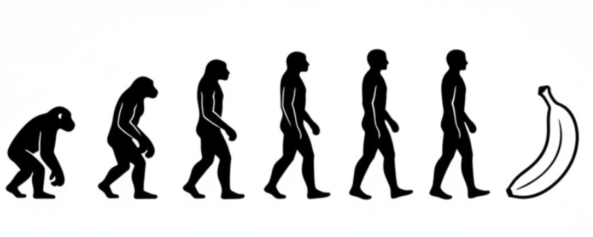

<div align="center">

 

[](LICENSE)
[](README.md)
[](README_en.md)
[](README_ja.md)
[](README_kr.md)
[](README_es.md)
[](README_tr.md)

</div>

> [!NOTE]
> Nano-Banana kullanılarak oluşturulan ve 150 bini aşkın yüksek kaliteli örnek içeren ilk veri kümesi Nano-consistent-150k’yı sunuyoruz. Bu veri kümesi, çeşitli ve karmaşık düzenleme senaryolarında insan kimliğinin tutarlılığını koruyacak şekilde özgün olarak tasarlanmıştır. Öne çıkan özelliği olağanüstü kimlik tutarlılığıdır: Tek bir portre için, farklı görev ve yönergeler boyunca 35’ten fazla farklı düzenleme çıktısı sağlanır. Tutarlı insan kimliklerini dayanak (ankor) alarak, aynı birey etrafında birden çok düzenleme görevi, yönerge ve modaliteyi kesintisiz biçimde birbirine bağlayan iç içe (interleaved) verilerin oluşturulmasına olanak tanır.
<a href='https://picotrex.github.io/Awesome-Nano-Banana-images/'></a>
<a href='https://huggingface.co/datasets/Yejy53/Nano-consistent-150k'></a>

## 🍌 Giriş

Nano-banana derlenmiş resim galerisine hoş geldiniz! 🤗 

**Nano-banana tarafından çeşitli görev senaryolarında oluşturulan çarpıcı görüntüleri ve istemleri topladık**, Google'ın görüntü oluşturma ve düzenlemedeki sınırsız olanaklarını kapsamlı bir şekilde sergiliyoruz. Bunun Nano-banana'yı daha iyi anlamanıza yardımcı olacağını umuyoruz. Nano-banana'nın çoklu görüntü birleştirme ve yaratıcı düzenleme gücünü birlikte ortaya çıkaralım! ✨

Bu vakalar temel olarak Twitter/X 🐦, Xiaohongshu 📕 ve diğer kişisel medya platformlarından gelmektedir.

Beğendiyseniz, lütfen yer imlerine eklemek için ⭐ Star verin!

## 📰 Haberler

- **24-Eylül-2025:** 5️⃣ Beşinci depo güncellemesi
- **18 Eylül 2025:** **Nano-consistent-150k** veri kümesini yayımladık
- **16-Eylül-2025:** 4️⃣ Dördüncü depo güncellemesi
- **9-Eylül-2025:** 3️⃣ Üçüncü depo güncellemesi
- **3-Eylül-2025:** 2️⃣ İkinci depo güncellemesi
- **28-Ağustos-2025:** 🎉 1️⃣ ${\color{red} İlk\ Awesome-Nano-Banana-images \ güncellemesi!}$

## 📑 Menü

- [🍌 Giriş](#-giriş)
- [📰 Haberler](#-haberler)
- [📑 Menü](#-menü)
- [🖼️ Örnekler](#️-örnekler)
  - [Örnek 1: İllüstrasyondan Figüre（geliştiren @ZHO\_ZHO\_ZHO）](#örnek-1-i̇llüstrasyondan-figüregeliştiren-zho_zho_zho)
  - [Örnek 2: Harita Okundan Yer Görünümü Oluşturma（geliştiren @tokumin）](#örnek-2-harita-okundan-yer-görünümü-oluşturmageliştiren-tokumin)
  - [Örnek 3: Gerçek Dünya AR Bilgileri（geliştiren @bilawalsidhu）](#örnek-3-gerçek-dünya-ar-bilgilerigeliştiren-bilawalsidhu)
  - [Örnek 4: 3B Binaları Çıkarma/İzometrik Modeller Yapma（geliştiren @Zieeett）](#örnek-4-3b-binaları-çıkarmai̇zometrik-modeller-yapmageliştiren-zieeett)
  - [Örnek 5: Farklı Dönemlerdeki Fotoğraflarınız（geliştiren @AmirMushich）](#örnek-5-farklı-dönemlerdeki-fotoğraflarınızgeliştiren-amirmushich)
  - [Örnek 6: Çoklu Referanslı Görüntü Oluşturma（geliştiren @MrDavids1）](#örnek-6-çoklu-referanslı-görüntü-oluşturmageliştiren-mrdavids1)
  - [Örnek 7: Otomatik Fotoğraf Düzenleme（geliştiren @op7418）](#örnek-7-otomatik-fotoğraf-düzenlemegeliştiren-op7418)
  - [Örnek 8: El Çizimi Çoklu Karakter Pozlarını Kontrol Eder（geliştiren @op7418）](#örnek-8-el-çizimi-çoklu-karakter-pozlarını-kontrol-edergeliştiren-op7418)
  - [Örnek 9: Çapraz Görüşlü Görüntü Oluşturma（geliştiren @op7418）](#örnek-9-çapraz-görüşlü-görüntü-oluşturmageliştiren-op7418)
  - [Örnek 10: Özel Karakter Çıkartmaları（geliştiren @op7418）](#örnek-10-özel-karakter-çıkartmalarıgeliştiren-op7418)
  - [Örnek 11: Anime'den Gerçek Cosplayer'a（geliştiren @ZHO\_ZHO\_ZHO）](#örnek-11-animeden-gerçek-cosplayerageliştiren-zho_zho_zho)
  - [Örnek 12: Karakter Tasarımı Oluştur（geliştiren @ZHO\_ZHO\_ZHO）](#örnek-12-karakter-tasarımı-oluşturgeliştiren-zho_zho_zho)
  - [Örnek 13: Renk Paleti ile Çizgi Sanatını Renklendir（geliştiren @ZHO\_ZHO\_ZHO）](#örnek-13-renk-paleti-ile-çizgi-sanatını-renklendirgeliştiren-zho_zho_zho)
  - [Örnek 14: Makale İnfografiği（geliştiren @黄建同学）](#örnek-14-makale-i̇nfografiğigeliştiren-黄建同学)
  - [Örnek 15: Birden Fazla Saç Stilini Değiştir（geliştiren @balconychy）](#örnek-15-birden-fazla-saç-stilini-değiştirgeliştiren-balconychy)
  - [Örnek 16: Model Ek Açıklama Açıklama Diyagramı（geliştiren @berryxia\_ai）](#örnek-16-model-ek-açıklama-açıklama-diyagramıgeliştiren-berryxia_ai)
  - [Örnek 17: Özel Mermer Heykel（geliştiren @umesh\_ai）](#örnek-17-özel-mermer-heykelgeliştiren-umesh_ai)
  - [Örnek 18: Malzemelere Göre Yemek Yap（geliştiren @Gdgtify）](#örnek-18-malzemelere-göre-yemek-yapgeliştiren-gdgtify)
  - [Örnek 19: Matematik Problemi Akıl Yürütme（geliştiren @Gorden Sun）](#örnek-19-matematik-problemi-akıl-yürütmegeliştiren-gorden-sun)
  - [Örnek 20: Eski Fotoğraf Renklendirme（geliştiren @GeminiApp）](#örnek-20-eski-fotoğraf-renklendirmegeliştiren-geminiapp)
  - [Örnek 21: OOTD Kıyafeti（geliştiren @302.AI）](#örnek-21-ootd-kıyafetigeliştiren-302ai)
  - [Örnek 22: Karakter Giysi Değişimi（geliştiren @skirano）](#örnek-22-karakter-giysi-değişimigeliştiren-skirano)
  - [Örnek 23: Çoklu Görünüm Sonucu Oluşturma（geliştiren @Error\_HTTP\_404）](#örnek-23-çoklu-görünüm-sonucu-oluşturmageliştiren-error_http_404)
  - [Örnek 24: Film Hikaye Panosu（geliştiren @GeminiApp）](#örnek-24-film-hikaye-panosugeliştiren-geminiapp)
  - [Örnek 25: Karakter Pozu Değişikliği（geliştiren @arrakis\_ai）](#örnek-25-karakter-pozu-değişikliğigeliştiren-arrakis_ai)
  - [Örnek 26: Çizgi çiziminden görüntü oluşturma（geliştiren @ZHO\_ZHO\_ZHO）](#örnek-26-çizgi-çiziminden-görüntü-oluşturmageliştiren-zho_zho_zho)
  - [Örnek 27: Resme Filigran Ekleme（geliştiren @AiMachete）](#örnek-27-resme-filigran-eklemegeliştiren-aimachete)
  - [Örnek 28: Bilgi Akıl Yürütme Görüntü Oluşturma（geliştiren @icreatelife）](#örnek-28-bilgi-akıl-yürütme-görüntü-oluşturmageliştiren-icreatelife)
  - [Örnek 29: Kırmızı Kalem Ek Açıklamaları（geliştiren @AiMachete）](#örnek-29-kırmızı-kalem-ek-açıklamalarıgeliştiren-aimachete)
  - [Örnek 30: Patlayıcı Yiyecek（geliştiren @icreatelife）](#örnek-30-patlayıcı-yiyecekgeliştiren-icreatelife)
  - [Örnek 31: Çizgi Roman Oluştur（geliştiren @icreatelife）](#örnek-31-çizgi-roman-oluşturgeliştiren-icreatelife)
  - [Örnek 32: Aksiyon Figürü（geliştiren @icreatelife）](#örnek-32-aksiyon-figürügeliştiren-icreatelife)
  - [Örnek 33: Haritadan İzometrik Binalara（geliştiren @demishassabis）](#örnek-33-haritadan-i̇zometrik-binalarageliştiren-demishassabis)
  - [Örnek 34: Referans Görüntü Karakter İfadesini Kontrol Eder（geliştiren @ZHO\_ZHO\_ZHO）](#örnek-34-referans-görüntü-karakter-i̇fadesini-kontrol-edergeliştiren-zho_zho_zho)
  - [Örnek 35: İllüstrasyon Çizim Süreci Dört Paneli（geliştiren @ZHO\_ZHO\_ZHO）](#örnek-35-i̇llüstrasyon-çizim-süreci-dört-paneligeliştiren-zho_zho_zho)
  - [Örnek 36: Sanal Makyaj Denemesi（geliştiren @ZHO\_ZHO\_ZHO）](#örnek-36-sanal-makyaj-denemesigeliştiren-zho_zho_zho)
  - [Örnek 37: Makyaj Analizi（geliştiren @ZHO\_ZHO\_ZHO）](#örnek-37-makyaj-analizigeliştiren-zho_zho_zho)
  - [Örnek 38: Orta Dünya'nın Google Haritalar Görünümü（geliştiren @TechHallo）](#örnek-38-orta-dünyanın-google-haritalar-görünümügeliştiren-techhallo)
  - [Örnek 39: Tipografik İllüstrasyon Oluşturma（geliştiren @Umesh）](#örnek-39-tipografik-i̇llüstrasyon-oluşturmageliştiren-umesh)
  - [Örnek 40: Çoklu Karakter Pozları Oluşturma（geliştiren @tapehead\_Lab）](#örnek-40-çoklu-karakter-pozları-oluşturmageliştiren-tapehead_lab)
  - [Örnek 41: Ürün Ambalajı Oluşturma（geliştiren @ZHO\_ZHO\_ZHO）](#örnek-41-ürün-ambalajı-oluşturmageliştiren-zho_zho_zho)
  - [Örnek 42: Kaplama Filtresi/Malzemesi（geliştiren @ZHO\_ZHO\_ZHO）](#örnek-42-kaplama-filtresimalzemesigeliştiren-zho_zho_zho)
  - [Örnek 43: Karakter Yüz Şeklini Kontrol Et（geliştiren @ZHO\_ZHO\_ZHO）](#örnek-43-karakter-yüz-şeklini-kontrol-etgeliştiren-zho_zho_zho)
  - [Örnek 44: Aydınlatma Kontrolü（geliştiren @ZHO\_ZHO\_ZHO）](#örnek-44-aydınlatma-kontrolügeliştiren-zho_zho_zho)
  - [Örnek 45: LEGO Minifigürü（geliştiren @ZHO\_ZHO\_ZHO）](#örnek-45-lego-minifigürügeliştiren-zho_zho_zho)
  - [Örnek 46: Gundam Model Figürü（geliştiren @ZHO\_ZHO\_ZHO）](#örnek-46-gundam-model-figürügeliştiren-zho_zho_zho)
  - [Örnek 47: Donanım Patlatılmış Görünümü（geliştiren @AIimagined）](#örnek-47-donanım-patlatılmış-görünümügeliştiren-aiimagined)
  - [Örnek 48: Yiyecek Kalori Ek Açıklaması（geliştiren @icreatelife）](#örnek-48-yiyecek-kalori-ek-açıklamasıgeliştiren-icreatelife)
  - [Örnek 49: Konuyu Çıkar ve Şeffaf Katmana Yerleştir（geliştiren @nglprz）](#örnek-49-konuyu-çıkar-ve-şeffaf-katmana-yerleştirgeliştiren-nglprz)
  - [Örnek 50: Görüntü Dış Boyama Onarımı（geliştiren @bwabbage）](#örnek-50-görüntü-dış-boyama-onarımıgeliştiren-bwabbage)
  - [Örnek 51: Antik Harita → Tarihi Sahne Fotoğrafı（geliştiren @levelsio）](#örnek-51-antik-harita--tarihi-sahne-fotoğrafıgeliştiren-levelsio)
  - [Örnek 52: Moda Moodboard Kolajı（geliştiren @tetumemo）](#örnek-52-moda-moodboard-kolajıgeliştiren-tetumemo)
  - [Örnek 53: Hassas Sevimli Ürün Fotoğrafı（geliştiren @azed\_ai）](#örnek-53-hassas-sevimli-ürün-fotoğrafıgeliştiren-azed_ai)
  - [Örnek 54: Gerçek Hayatta Anime Heykeli Yerleştirin（geliştiren @riddi0908）](#örnek-54-gerçek-hayatta-anime-heykeli-yerleştiringeliştiren-riddi0908)
  - [Örnek 55: Bir Itasha Arabası Oluşturun（geliştiren @riddi0908）](#örnek-55-bir-itasha-arabası-oluşturungeliştiren-riddi0908)
  - [Örnek 56: Manga Kompozisyonu（geliştiren @namaedousiyoka）](#örnek-56-manga-kompozisyonugeliştiren-namaedousiyoka)
  - [Örnek 57: Manga Stili Dönüşümü（geliştiren @nobisiro\_2023）](#örnek-57-manga-stili-dönüşümügeliştiren-nobisiro_2023)
  - [Örnek 58: İzometrik Holografik Tel Çerçeve（geliştiren @tetumemo）](#örnek-58-i̇zometrik-holografik-tel-çerçevegeliştiren-tetumemo)
  - [Örnek 59: Minecraft Tarzı Sahne Oluşturma（geliştiren @tetumemo）](#örnek-59-minecraft-tarzı-sahne-oluşturmageliştiren-tetumemo)
  - [Örnek 60: Logoya Malzeme Küresi Uygula（geliştiren @ZHO\_ZHO\_ZHO）](#örnek-60-logoya-malzeme-küresi-uygulageliştiren-zho_zho_zho)
  - [Örnek 61: Kat Planı 3B İşleme（geliştiren @op7418）](#örnek-61-kat-planı-3b-i̇şlemegeliştiren-op7418)
  - [Örnek 62: Kamera Parametrelerini Sıfırla（geliştiren @hckinz）](#örnek-62-kamera-parametrelerini-sıfırlageliştiren-hckinz)
  - [Örnek 63: Vesikalık Fotoğraf Oluştur（geliştiren @songguoxiansen）](#örnek-63-vesikalık-fotoğraf-oluşturgeliştiren-songguoxiansen)
  - [Örnek 64: Sahne A6 Katlanır Kart（geliştiren @Gdgtify）](#örnek-64-sahne-a6-katlanır-kartgeliştiren-gdgtify)
  - [Örnek 65: Bir Satranç Takımı Tasarla（geliştiren @Gdgtify）](#örnek-65-bir-satranç-takımı-tasarlageliştiren-gdgtify)
  - [Örnek 66: Bölünmüş Kontrast Stil Fotoğrafı（geliştiren @fofrAI）](#örnek-66-bölünmüş-kontrast-stil-fotoğrafıgeliştiren-fofrai)
  - [Örnek 67: Takı Koleksiyonu Tasarımı（geliştiren @Gdgtify）](#örnek-67-takı-koleksiyonu-tasarımıgeliştiren-gdgtify)
  - [Örnek 68: Ürün Tasarımı（geliştiren @0xFramer）](#örnek-68-ürün-tasarımıgeliştiren-0xframer)
  - [Örnek 69: Model Holografik Projeksiyon (geliştiren @UNIBRACITY)](#örnek-69-model-holografik-projeksiyon-geliştiren-unibracity)
  - [Örnek 70: Dev Figür İskelesi (geliştiren @songguoxiansen)](#örnek-70-dev-figür-i̇skelesi-geliştiren-songguoxiansen)
  - [Örnek 71: Uzaktan Algılama Görüntüsünden Bina Çıkarma (geliştiren @lehua555)](#örnek-71-uzaktan-algılama-görüntüsünden-bina-çıkarma-geliştiren-lehua555)
  - [Örnek 72: Bileşen Çıkarma (geliştiren @tetumemo)](#örnek-72-bileşen-çıkarma-geliştiren-tetumemo)
  - [Örnek 73: Burger Malzemelerini Kaldır (geliştiren @bind\_lux, örnek @jeanlucaslima tarafından sağlanmıştır)](#örnek-73-burger-malzemelerini-kaldır-geliştiren-bind_lux-örnek-jeanlucaslima-tarafından-sağlanmıştır)
  - [Örnek 74: Yüksek Çözünürlüklü Görüntü Restorasyonu (geliştiren @op7418)](#örnek-74-yüksek-çözünürlüklü-görüntü-restorasyonu-geliştiren-op7418)
  - [Örnek 75: Görüntüden Minyatür Sahne Oluştur (geliştiren @techhalla)](#örnek-75-görüntüden-minyatür-sahne-oluştur-geliştiren-techhalla)
  - [Örnek 76: Eğitici Çizgi Roman (geliştiren @op7418)](#örnek-76-eğitici-çizgi-roman-geliştiren-op7418)
  - [Örnek 77: Özel Karakter Emoji Paketi Oluşturma (geliştiren @vista8)](#örnek-77-özel-karakter-emoji-paketi-oluşturma-geliştiren-vista8)
  - [Örnek 78: Kısmen Yenmiş Yiyecekleri Geri Yükle (geliştiren @googlejapan)](#örnek-78-kısmen-yenmiş-yiyecekleri-geri-yükle-geliştiren-googlejapan)
  - [Örnek 79: Dövüş Oyunu Arayüzü Oluşturma (geliştiren @NanoBanana\_labs)](#örnek-79-dövüş-oyunu-arayüzü-oluşturma-geliştiren-nanobanana_labs)
  - [Örnek 80: Model Kesiti (geliştiren @old\_pgmrs\_will)](#örnek-80-model-kesiti-geliştiren-old_pgmrs_will)
  - [Örnek 81: Korsan Aranıyor Posteri (geliştiren @AI\_Kei75)](#örnek-81-korsan-aranıyor-posteri-geliştiren-ai_kei75)
  - [Örnek 82: Ürün Teşhir Rafı (geliştiren @tokyo\_Valentine)](#örnek-82-ürün-teşhir-rafı-geliştiren-tokyo_valentine)
  - [Örnek 83: Çizgi Roman Fuarı Standı (geliştiren @tokyo\_Valentine)](#örnek-83-çizgi-roman-fuarı-standı-geliştiren-tokyo_valentine)
  - [Örnek 84: Çizgi Sanatından Karalama Çizimine (geliştiren @hAru\_mAki\_ch)](#örnek-84-çizgi-sanatından-karalama-çizimine-geliştiren-haru_maki_ch)
  - [Örnek 85: Çağdaş Sanat Sergi Alanı (geliştiren @UNIBRACITY)](#örnek-85-çağdaş-sanat-sergi-alanı-geliştiren-unibracity)
  - [Örnek 86: Koyu Gotik Tarot Kartı (geliştiren @ImperfectEngel)](#örnek-86-koyu-gotik-tarot-kartı-geliştiren-imperfectengel)
  - [Örnek 87: Siyah Beyaz Evrim Şeması (geliştiren @ZHO\_ZHO\_ZHO)](#örnek-87-siyah-beyaz-evrim-şeması-geliştiren-zho_zho_zho)
  - [Örnek 88: Cam Şişe Hatıra Eşyası (geliştiren @NanoBanana\_labs)](#örnek-88-cam-şişe-hatıra-eşyası-geliştiren-nanobanana_labs)
  - [Örnek 89: Minyatür Mağaza (geliştiren @NanoBanana\_labs)](#örnek-89-minyatür-mağaza-geliştiren-nanobanana_labs)
  - [Örnek 90: Vtuber Ol (geliştiren @AI\_Kei75)](#örnek-90-vtuber-ol-geliştiren-ai_kei75)
  - [Örnek 91: Tren İstasyonu Film Posteri (geliştiren @AI\_Kei75)](#örnek-91-tren-i̇stasyonu-film-posteri-geliştiren-ai_kei75)
  - [Örnek 92: Sinema Dinlenme Salonu (geliştiren @tokyo\_Valentine)](#örnek-92-sinema-dinlenme-salonu-geliştiren-tokyo_valentine)
  - [Örnek 93: Çizgi Film Patlamalı Kesilmiş Nesne (geliştiren @Arminn_Ai)](#örnek-93-çizgi-film-patlamalı-kesilmiş-nesne-geliştiren-arminn_ai)
  - [Örnek 94: Karakter Temalı Tren (geliştiren @tokyo\_Valentine)](#örnek-94-karakter-temalı-tren-geliştiren-tokyo_valentine)
  - [Örnek 95: Özelleştirilmiş Tema Parkı (geliştiren @AI\_Kei75)](#örnek-95-özelleştirilmiş-tema-parkı-geliştiren-ai_kei75)
  - [Örnek 96: Takımyıldız Görseli Oluştur (geliştiren @AI\_Kei75)](#örnek-96-takımyıldız-görseli-oluştur-geliştiren-ai_kei75)
  - [Örnek 97: Görseli Telefon Duvar Kağıdına Çevir (geliştiren @ZHO\_ZHO\_ZHO)](#örnek-97-görseli-telefon-duvar-kağıdına-çevir-geliştiren-zho_zho_zho)
  - [Örnek 98: Film Posteri Yap (geliştiren @aiehon_aya)](#örnek-98-film-posteri-yap-geliştiren-aiehon_aya)
  - [Örnek 99: X Hesabını Diskete Dönüştür (geliştiren @icreatelife)](#örnek-99-x-hesabını-diskete-dönüştür-geliştiren-icreatelife)
  - [Örnek 100: Referans Nesneyi Şeffaf Yap (geliştiren @icreatelife)](#örnek-100-referans-nesneyi-şeffaf-yap-geliştiren-icreatelife)
  - [Örnek 101: Balıkgözü Kapı Gözü İllüstrasyonu (geliştiren @emakiscroll)](#örnek-101-balıkgözü-kapı-gözü-illüstrasyonu-geliştiren-emakiscroll)
  - [Örnek 102: Süper Kahraman İç Mekan Tasarımı (geliştiren @IqraSaifiii)](#örnek-102-süper-kahraman-iç-mekan-tasarımı-geliştiren-iqrasafiii)
  - [Örnek 103: Özel Pençe Makinesi (geliştiren @googlejapan)](#örnek-103-özel-pençe-makinesi-geliştiren-googlejapan)
  - [Örnek 104: Tipografi Logo Tasarımı (geliştiren @aziz4ai)](#örnek-104-tipografi-logo-tasarımı-geliştiren-aziz4ai)
  - [Örnek 105: RPG Karakter Statü Ekranı (geliştiren @AI\_Kei75)](#örnek-105-rpg-karakter-statü-ekranı-geliştiren-ai_kei75)
  - [Örnek 106: Açıklama Diyagramını Piktogram Yap (geliştiren @nobisiro_2023)](#örnek-106-açıklama-diyagramını-piktogram-yap-geliştiren-nobisiro_2023)
  - [Örnek 107: Grafik Tablet Çizimi (geliştiren @AI\_Kei75)](#örnek-107-grafik-tablet-çizimi-geliştiren-ai_kei75)
  - [Örnek 108: LINE Sticker Görseli Oluştur (geliştiren @emakiscroll)](#örnek-108-line-sticker-görseli-oluştur-geliştiren-emakiscroll)
  - [Örnek 109: Çocukluk Benliğine Terapi (geliştiren @samann_ai)](#örnek-109-çocukluk-benliğine-terapi-geliştiren-samann_ai)
  - [Örnek 110: Pixar Tarzı Portre (geliştiren @NanoBanana\_labs)](#örnek-110-pixar-tarzı-portre-geliştiren-nanobanana_labs)
- [🙏 Teşekkür](#-teşekkür)

## 🖼️ Örnekler

<!-- Örnek 1: İllüstrasyondan Figüre (geliştiren @ZHO_ZHO_ZHO) -->
### Örnek 1: [İllüstrasyondan Figüre](https://x.com/ZHO_ZHO_ZHO/status/1958539464994959715)（geliştiren [@ZHO_ZHO_ZHO](https://x.com/ZHO_ZHO_ZHO)）

| Girdi | Çıktı |
|:---:|:---:|
|  |  |


**girdi:** Figürü oluşturmak için referans bir resmi nesne olarak yüklemeniz gerekir

**prompt:**

```
bu fotoğrafı bir karakter figürüne dönüştürün. Arkasına, üzerinde karakterin resminin basılı olduğu bir kutu ve ekranında Blender modelleme sürecini gösteren bir bilgisayar yerleştirin. Kutunun önüne, üzerinde karakter figürünün durduğu yuvarlak bir plastik taban ekleyin. mümkünse sahneyi iç mekanda ayarlayın
```

<!-- Örnek 2: Harita Okundan Yer Görünümü Oluşturma (geliştiren @tokumin) -->
### Örnek 2: [Harita Okundan Yer Görünümü Oluşturma](https://x.com/tokumin/status/**1960583251460022626**)（geliştiren [@tokumin](https://x.com/tokumin)）

| Girdi | Çıktı |
|:---:|:---:|
|  |  |
|  |  |
|  |  |

**girdi:** Kırmızı ok içeren bir Google Haritalar resmi yüklemeniz gerekir

**prompt:**

```
kırmızı okun gördüğünü çiz
/
kırmızı daireden okun yönünde gerçek dünya görünümünü çizin.
```

<!-- Örnek 3: Gerçek Dünya AR Bilgileri (geliştiren @bilawalsidhu) -->
### Örnek 3: [Gerçek Dünya AR Bilgileri](https://x.com/bilawalsidhu/status/1960529167742853378)（geliştiren [@bilawalsidhu](https://x.com/bilawalsidhu)）

| Çıktı |
|:---:|
|  |

**girdi:** Bir referans resmi yüklemeniz gerekir

**prompt:**

```
sen bir konum tabanlı AR deneyimi oluşturucususun. bu resimdeki [ilgi çekici noktayı] vurgula ve hakkında ilgili bilgileri not et.
```

> [!NOTE]
> **Prompt'ta [POI] olarak not edilecek ilgi çekici noktayı girmeniz gerekir**

<!-- Örnek 4: 3B Binaları Çıkarma/İzometrik Modeller Yapma (geliştiren @Zieeett) -->
### Örnek 4: [3B Binaları Çıkarma/İzometrik Modeller Yapma](https://x.com/Zieeett/status/1960420874806247762)（geliştiren [@Zieeett](https://x.com/Zieeett)）

| Girdi | Çıktı |
|:---:|:---:|
|  |  |
|  |  |

**girdi:** İlgili nesneyi içeren bir resim yüklemeniz gerekir

**prompt:**

```
Resmi Gündüz ve İzometrik Yap [Sadece Bina]
```

> [!NOTE]
> **[köşeli parantez] içindeki bilgileri gerektiği gibi değiştirin (araçlar, insanlar vb. olarak ayarlanabilir)**

<!-- Örnek 5: Farklı Dönemlerdeki Fotoğraflarınız (geliştiren @AmirMushich) -->
### Örnek 5: [Farklı Dönemlerdeki Fotoğraflarınız](https://x.com/AmirMushich/status/1960810850224091439)（geliştiren [@AmirMushich](https://x.com/AmirMushich)）

| Girdi | Çıktı |
|:---:|:---:|
|  |  |


**girdi:** Bir kişi fotoğrafı yüklemeniz gerekir

**prompt:**

```
Karakterin stilini [1970]'lerin klasik [erkek] stiline değiştirin

[uzun kıvırcık] saç ekleyin,
[uzun bıyık],
arka planı ikonik [kaliforniya yaz manzarası] olarak değiştirin

Karakterin yüzünü değiştirmeyin
```

> [!NOTE]
> **[köşeli parantez] içindeki metni kendi döneminize ve detay bilgilerinize göre değiştirin**

<!-- Örnek 6: Çoklu Referanslı Görüntü Oluşturma (geliştiren @MrDavids1) -->
### Örnek 6: [Çoklu Referanslı Görüntü Oluşturma](https://x.com/MrDavids1/status/1960783672665128970)（geliştiren [@MrDavids1](https://x.com/MrDavids1)）

| Girdi | Çıktı |
|:---:|:---:|
|  |  |


**girdi:** Birden fazla referans resmi yüklemeniz gerekir

**prompt:**

```
Bir model poz veriyor ve pembe bir bmw'ye yaslanıyor. Aşağıdaki eşyaları giyiyor, sahne açık gri bir arka plana karşı. Yeşil uzaylı bir anahtarlık ve pembe el çantasına takılı. Modelin omzunda pembe bir papağan da var. Yanında pembe tasmali ve altın kulaklıklı bir pug oturuyor.
```

> [!NOTE]
> **Prompt'un ayrıntılı olarak tanımlanması ve birden çok referans nesnesi içermesi gerekir**

<!-- Örnek 7: Otomatik Fotoğraf Düzenleme (geliştiren @op7418) -->
### Örnek 7: [Otomatik Fotoğraf Düzenleme](https://x.com/op7418/status/1960528616573558864)（geliştiren [@op7418](https://x.com/op7418)）

| Girdi | Çıktı |
|:---:|:---:|
|  |  |


**girdi:** Düzeltilmesi gereken bir resim yüklemeniz gerekir

**prompt:**

```
Bu fotoğraf çok sıkıcı ve sade. Geliştirin! Kontrastı artırın, renkleri canlandırın ve daha zengin hale getirmek için aydınlatmayı iyileştirin, Kompozisyonu etkileyen ayrıntıları kırpabilir ve silebilirsiniz.
```

<!-- Örnek 8: El Çizimi Çoklu Karakter Pozlarını Kontrol Eder (geliştiren @op7418) -->
### Örnek 8: [El Çizimi Çoklu Karakter Pozlarını Kontrol Eder](https://x.com/op7418/status/1960536717242573181)（geliştiren [@op7418](https://x.com/op7418)）

| Girdi | Çıktı |
|:---:|:---:|
|  |  |


**girdi:** Karakter resimleri ve el çizimi eskizleri yüklemeniz gerekir

**prompt:**

```
Bu iki karakterin Şekil 3'teki pozu kullanarak dövüşmesini sağlayın. Uygun görsel arka planlar ve sahne etkileşimleri ekleyin, Oluşturulan görüntü oranı 16:9'dur
```

<!-- Örnek 9: Çapraz Görüşlü Görüntü Oluşturma (geliştiren @op7418) -->
### Örnek 9: [Çapraz Görüşlü Görüntü Oluşturma](https://x.com/op7418/status/1960896630586310656)（geliştiren [@op7418](https://x.com/op7418)）

| Girdi | Çıktı |
|:---:|:---:|
|  |  |


**girdi:** Yerden çekilmiş bir fotoğraf yüklemeniz gerekir

**prompt:**

```
Fotoğrafı yukarıdan aşağıya bir görünüme dönüştürün ve fotoğrafçının konumunu işaretleyin.
```

<!-- Örnek 10: Özel Karakter Çıkartmaları (geliştiren @op7418) -->
### Örnek 10: [Özel Karakter Çıkartmaları](https://x.com/op7418/status/1960385812132192509)（geliştiren [@op7418](https://x.com/op7418)）

| Girdi | Çıktı |
|:---:|:---:|
|  |  |


**girdi:** Bir çıkartma referans resmi ve bir karakter resmi yüklemeniz gerekir

**prompt:**

```
Karakteri Şekil 2'ye benzer beyaz anahatlı bir çıkartmaya dönüştürmeme yardım edin. Karakterin bir web illüstrasyon stiline dönüştürülmesi ve Şekil 1'i tanımlayan eğlenceli bir beyaz anahatlı kısa bir ifade eklenmesi gerekiyor.
```

<!-- Örnek 11: Anime'den Gerçek Cosplayer'a (geliştiren @ZHO_ZHO_ZHO) -->
### Örnek 11: [Anime'den Gerçek Cosplayer'a](https://x.com/ZHO_ZHO_ZHO/status/1960946893971706306)（geliştiren [@ZHO_ZHO_ZHO](https://x.com/ZHO_ZHO_ZHO)）

| Girdi | Çıktı |
|:---:|:---:|
|  |  |


**girdi:** Bir illüstrasyon resmi yüklemeniz gerekir

**prompt:**

```
Bu illüstrasyonu cosplay yapan bir kızın fotoğrafını oluşturun, arka plan Comiket'te ayarlandı
```

<!-- Örnek 12: Karakter Tasarımı Oluştur (geliştiren @ZHO_ZHO_ZHO) -->
### Örnek 12: [Karakter Tasarımı Oluştur](https://x.com/ZHO_ZHO_ZHO/status/1960669234276753542)（geliştiren [@ZHO_ZHO_ZHO](https://x.com/ZHO_ZHO_ZHO)）

| Girdi | Çıktı |
|:---:|:---:|
|  |  |


**girdi:** Bir karakter referans resmi yüklemeniz gerekir

**prompt:**

```
Benim için karakter tasarımı oluştur (Karakter Tasarımı)

Oran tasarımı (farklı yükseklik karşılaştırmaları, baş-vücut oranı vb.)

Üç görünüm (ön, yan, arka)

İfade tasarımı (İfade Sayfası) → gönderdiğiniz resim gibi

Poz tasarımı (Poz Sayfası) → çeşitli yaygın pozlar

Kostüm tasarımı (Kostüm Tasarımı)
```

<!-- Örnek 13: Renk Paleti ile Çizgi Sanatını Renklendir (geliştiren @ZHO_ZHO_ZHO) -->
### Örnek 13: [Renk Paleti ile Çizgi Sanatını Renklendir](https://x.com/ZHO_ZHO_ZHO/status/1960652077891510752)（geliştiren [@ZHO_ZHO_ZHO](https://x.com/ZHO_ZHO_ZHO)）

| Girdi | Çıktı |
|:---:|:---:|
|  |  |


**girdi:** Bir çizgi sanatı resmi ve bir renk paleti resmi yüklemeniz gerekir

**prompt:**

```
Şekil 1'deki karakteri renklendirmek için Şekil 2'deki renk paletini doğru bir şekilde kullanın
```

<!-- Örnek 14: Makale İnfografiği (geliştiren @黄建同学) -->
### Örnek 14: [Makale İnfografiği](https://weibo.com/5648162302/5204549851155423?wm=3333_2001&from=10F8393010&sourcetype=weixin&s_trans=7836809604_5204549851155423&s_channel=4)（geliştiren [@黄建同学](https://weibo.com/u/5648162302)）

| Çıktı |
|:---:|
|  |


**girdi:** Bir blog/makale yüklemeniz gerekir

**prompt:**

```
Makale içeriği için bir infografik oluşturun
Gereksinimler:
1. İçeriği İngilizce'ye çevirin ve makaleden önemli bilgileri çıkarın
2. Resimdeki içeriği kısa tutun, yalnızca ana başlığı koruyun
3. Resimde İngilizce metin kullanın
4. Zengin ve sevimli çizgi film karakterleri ve öğeleri ekleyin
```

<!-- Örnek 15: Birden Fazla Saç Stilini Değiştir (geliştiren @balconychy) -->
### Örnek 15: [Birden Fazla Saç Stilini Değiştir](https://x.com/balconychy/status/1960665038504779923)（geliştiren [@balconychy](https://x.com/balconychy)）

| Çıktı |
|:---:|
|  |


**girdi:** Saç stili değişikliği gerektiren bir portre resmi yüklemeniz gerekir

**prompt:**

```
Bu kişinin farklı saç stillerine sahip avatarlarını 3x3 ızgara formatında oluşturun
```

<!-- Örnek 16: Model Ek Açıklama Açıklama Diyagramı (geliştiren @berryxia_ai) -->
### Örnek 16: [Model Ek Açıklama Açıklama Diyagramı](https://x.com/berryxia_ai/status/1960708465586004305)（geliştiren [@berryxia_ai](https://x.com/berryxia_ai)）

| Çıktı |
|:---:|
|  |

> [!CAUTION]
> Ek açıklama sonuçlarında önemli sayıda hata var ⚠️. Lütfen Nano-Banana ek açıklamalarının tamamen doğru olmadığını ve kullanmadan önce bilgilerin doğruluğunu dikkatlice doğrulamanız gerektiğini unutmayın.

**prompt:**

```
Akademik sunum için [3D insan organı modeli görüntüleme örneği kalp] çizin, ek açıklamalar ve açıklamalarla, ilkelerini ve [her organın] işlevlerini sergilemek için uygun, çok gerçekçi, son derece ayrıntılı, son derece ince tasarımlı.
```

> [!NOTE]
> **[köşeli parantez] içindeki metni sergilemek istediğiniz modele göre değiştirin**

<!-- Örnek 17: Özel Mermer Heykel (geliştiren @umesh_ai) -->
### Örnek 17: [Özel Mermer Heykel](https://x.com/umesh_ai/status/1960370946562564353)（geliştiren [@umesh_ai](https://x.com/umesh_ai)）

| Çıktı |
|:---:|
|  |

**girdi:** Bir referans resmi yüklemeniz gerekir

**prompt:**

```
Parlak mermerden yapılmış resimdeki konunun ultra ayrıntılı bir heykelinin fotogerçekçi bir görüntüsü. Heykel, parlaklığını ve sanatsal işçiliğini vurgulayan pürüzsüz ve yansıtıcı mermer yüzeyi sergilemelidir. Tasarım zariftir, mermerin güzelliğini ve derinliğini vurgular. Resimdeki aydınlatma, heykelin hatlarını ve dokularını geliştirmeli, görsel olarak çarpıcı ve büyüleyici bir etki yaratmalıdır.
```

<!-- Örnek 18: Malzemelere Göre Yemek Yap (geliştiren @Gdgtify) -->
### Örnek 18: [Malzemelere Göre Yemek Yap](https://x.com/Gdgtify/status/1960907695348691075)（geliştiren [@Gdgtify](https://x.com/Gdgtify)）

| Girdi | Çıktı |
|:---:|:---:|
|  |  |
|  |  |
|  |  |

**girdi:** Çeşitli malzemeler içeren bir fotoğraf yüklemeniz gerekir

**prompt:**

```
bana bu malzemelerle lezzetli bir öğle yemeği yap ve bir tabağa koy, tabağın yakınlaştırılmış görünümü, diğer tabakları ve malzemeleri kaldır.
```

<!-- Örnek 19: Matematik Problemi Akıl Yürütme (geliştiren @Gorden Sun) -->
### Örnek 19: [Matematik Problemi Akıl Yürütme](https://www.xiaohongshu.com/explore/68ade0e7000000001d036677?note_flow_source=wechat&xsec_token=AB4tWI6xCrE2v5euckYXKCBlbQbA-YNoqI5iKKqqQwWpY=)（geliştiren [@Gorden Sun](https://www.xiaohongshu.com/user/profile/632e72f900000000230397fe?xsec_token=ABeSWJqqsTwTtj3KG1HSTt_vwRcODR4jDJnj2dp0k42YI%3D&xsec_source=pc_note)）

| Girdi | Çıktı |
|:---:|:---:|
|  |  |


**girdi:** Bir matematik problemi yüklemeniz gerekir

**prompt:**

```
Sorunun cevabını soruya göre ilgili yere yazın
```

<!-- Örnek 20: Eski Fotoğraf Renklendirme (geliştiren @GeminiApp) -->
### Örnek 20: [Eski Fotoğraf Renklendirme](https://x.com/GeminiApp/status/1960347483021959197)（geliştiren [@GeminiApp](https://x.com/GeminiApp)）

| Girdi | Çıktı |
|:---:|:---:|
|  |  |


**girdi:** Restorasyon gerektiren eski bir fotoğraf yüklemeniz gerekir

**prompt:**

```
bu fotoğrafı geri yükle ve renklendir.
```

<!-- Örnek 21: OOTD Kıyafeti (geliştiren @302.AI) -->
### Örnek 21: [OOTD Kıyafeti](https://medium.com/%40302.AI/google-nano-banana-vs-qwen-gpt-flux-topping-the-image-editing-leaderboard-96038b01bdcd)（geliştiren [@302.AI](https://medium.com/@302.AI)）

| Girdi | Çıktı |
|:---:|:---:|
|  |  |


**girdi:** Bir kişi resmi ve giysi resmi yüklemeniz gerekir

**prompt:**

```
Resim 1'deki kişiyi seçin ve Resim 2'deki tüm giysi ve aksesuarları giydirin. Doğal aydınlatma, şık bir sokak stili ve net tam vücut çekimleri kullanarak açık havada bir dizi gerçekçi OOTD tarzı fotoğraf çekin. Resim 1'deki kişinin kimliğini ve pozunu koruyun, ancak Resim 2'deki eksiksiz kıyafeti ve aksesuarları uyumlu, şık bir şekilde gösterin.
```

<!-- Örnek 22: Karakter Giysi Değişimi (geliştiren @skirano) -->
### Örnek 22: [Karakter Giysi Değişimi](https://x.com/skirano/status/1960343968320737397)（geliştiren [@skirano](https://x.com/skirano)）

| Girdi | Çıktı |
|:---:|:---:|
|  |  |


**girdi:** Kişi resmi ve giysi resmi yüklemeniz gerekir

**prompt:**

```
Giriş resmindeki kişinin giysilerini referans resimde gösterilen hedef giysilerle değiştirin. Kişinin pozunu, yüz ifadesini, arka planını ve genel gerçekçiliğini değiştirmeyin. Yeni kıyafetin doğal, iyi oturan ve aydınlatma ve gölgelerle tutarlı görünmesini sağlayın. Kişinin kimliğini veya çevresini değiştirmeyin - yalnızca kıyafetleri değiştirin.
```

<!-- Örnek 23: Çoklu Görünüm Sonucu Oluşturma (geliştiren @Error_HTTP_404) -->
### Örnek 23: [Çoklu Görünüm Sonucu Oluşturma](https://x.com/Error_HTTP_404/status/1960405116701303294)（geliştiren [@Error_HTTP_404](https://x.com/Error_HTTP_404)）

| Girdi | Çıktı |
|:---:|:---:|
|  |  |


**girdi:** Referans resmi yüklemeniz gerekir

**prompt:**

```
Ön, Arka, Sol, Sağ, Üst, Alt görünümleri beyaz üzerine oluşturun. Eşit aralıklı. Tutarlı konu. İzometrik Perspektif Eşdeğerliği.
```

<!-- Örnek 24: Film Hikaye Panosu（geliştiren [@GeminiApp](@GeminiApp)） -->
### Örnek 24: Film Hikaye Panosu（geliştiren [@GeminiApp](@GeminiApp)）

| Girdi | Çıktı |
|:---:|:---:|
|  |  |


**girdi:** Referans resmi yüklemeniz gerekir

**prompt:**

```
Bu iki karakterle klasik bir siyah beyaz film noir dedektif hikayesinde 12 resimden oluşan bağımlılık yaratan ilgi çekici 12 bölümlük bir hikaye oluşturun. Hikayeyi, boyunca ipuçları aldıkları ve sonunda keşfettikleri kayıp hazine hakkında yapın. Hikaye, duygusal iniş ve çıkışlarla dolu ve harika bir bükülme ve yüksek bir notla biten heyecan verici. Resimlere herhangi bir kelime veya metin eklemeyin, ancak hikayeyi tamamen görüntülerin kendisi aracılığıyla anlatın.
```

<!-- Örnek 25: Karakter Pozu Değişikliği (geliştiren @arrakis_ai) -->
### Örnek 25: [Karakter Pozu Değişikliği](https://x.com/arrakis_ai/status/1955901155726516652)（geliştiren [@arrakis_ai](https://x.com/arrakis_ai)）

| Girdi | Çıktı |
|:---:|:---:|
|  |  |


**girdi:** Referans resmi yüklemeniz gerekir

**prompt:**

```
Resimdeki kişinin dümdüz ileri bakmasını sağlayın
```

<!-- Örnek 26: Çizgi çiziminden görüntü oluşturma（geliştiren @ZHO_ZHO_ZHO） -->
### Örnek 26: [Çizgi çiziminden görüntü oluşturma](https://x.com/ZHO_ZHO_ZHO/status/1961024423596872184)（geliştiren [@ZHO_ZHO_ZHO](https://x.com/ZHO_ZHO_ZHO)）

| Girdi | Çıktı |
|:---:|:---:|
|  |  |


**Girdi:** Çizgi çizimleri ve referans resimleri yüklemeniz gerekir

**Prompt:**

```
Şekil 1'deki kişinin pozunu Şekil 2'deki gibi değiştirin ve profesyonel bir stüdyoda çekim yapın
```

<!-- Örnek 27: Resme Filigran Ekleme (geliştiren @AiMachete) -->
### Örnek 27: [Resme Filigran Ekleme](https://x.com/AiMachete/status/1963038793705128219)（geliştiren [@AiMachete](https://x.com/AiMachete)）

| Girdi | Çıktı |
|:---:|:---:|
|  |  |


**Girdi:** Bir referans resmi yüklemeniz gerekir

**Prompt:**

```
‘TRUMP’ kelimesini tüm resmin üzerine tekrar tekrar filigran olarak ekleyin.
```

<!-- Örnek 28: Bilgi Akıl Yürütme Görüntü Oluşturma (geliştiren @icreatelife) -->
### Örnek 28: [Bilgi Akıl Yürütme Görüntü Oluşturma](https://x.com/icreatelife/status/1962998951948517428)（geliştiren [@icreatelife](https://x.com/icreatelife)）

| Çıktı |
|:---:|
|  |
|  |

**Prompt:**

```
Bana dünyanın en yüksek 5 binasının bir infografiğini yap / Dünyadaki en tatlı şeylerin renkli bir infografiğini yap
```

<!-- Örnek 29: Kırmızı Kalem Ek Açıklamaları (geliştiren @AiMachete) -->
### Örnek 29: [Kırmızı Kalem Ek Açıklamaları](https://x.com/AiMachete/status/1962356993550643355)（geliştiren [@AiMachete](https://x.com/AiMachete)）

| Girdi | Çıktı |
|:---:|:---:|
|  |  |

**Girdi:** Bir referans resmi yüklemeniz gerekir

**Prompt:**

```
Bu resmi analiz et. Geliştirebileceğin yerleri belirtmek için kırmızı kalem kullan.
```

<!-- Örnek 30: Patlayıcı Yiyecek (geliştiren @icreatelife) -->
### Örnek 30: [Patlayıcı Yiyecek](https://x.com/icreatelife/status/1962724040205803773)（geliştiren [@icreatelife](https://x.com/icreatelife)）

| Çıktı |
|:---:|
|  |
|  |

**Girdi:** Bir referans resmi yüklemeniz gerekir

**Prompt:**

```
Bu ürünü, tazeliğini ve besin değerini simgeleyen, ürünün etrafında uçuşan taze ve çiğ temel bileşenlerin patlayıcı dışa dönük dinamik bir düzenlemesi eşliğinde dramatik modern bir sahnede fotoğraflayın. metinsiz, ürün vurgulanmış, arka plan olarak temel marka renkleri ile promo reklam çekimi.
```

<!-- Örnek 31: Çizgi Roman Oluştur (geliştiren @icreatelife) -->
### Örnek 31: [Çizgi Roman Oluştur](https://x.com/icreatelife/status/1961977580849873169)（geliştiren [@icreatelife](https://x.com/icreatelife)）

| Girdi | Çıktı |
|:---:|:---:|
|  |  |

**Girdi:** Bir referans resmi yüklemeniz gerekir

**Prompt:**

```
Yüklenen resme dayanarak bir çizgi roman şeridi yapın, metin ekleyin, ilgi çekici bir hikaye yazın. Bir süper kahraman çizgi romanı istiyorum.
```

<!-- Örnek 32: Aksiyon Figürü (geliştiren @icreatelife) -->
### Örnek 32: [Aksiyon Figürü](https://x.com/icreatelife/status/1961653618529935720)（geliştiren [@icreatelife](https://x.com/icreatelife)）

| Girdi | Çıktı |
|:---:|:---:|
|  |  |

**Girdi:** Bir referans resmi yüklemeniz gerekir

**Prompt:**

```
bana [“AI Evangelisti - Kris”] yazan ve [kahve, kaplumbağa, dizüstü bilgisayar, telefon ve kulaklık] içeren bir aksiyon figürü yap

```
> [!NOTE]
> **[köşeli parantez] içindeki metni eklemek istediğiniz öğelere göre değiştirin**


<!-- Örnek 33: Haritadan İzometrik Binalara (geliştiren @demishassabis) -->
### Örnek 33: [Haritadan İzometrik Binalara](https://x.com/demishassabis/status/1961077016830083103)（geliştiren [@demishassabis](https://x.com/demishassabis)）

| Girdi | Çıktı |
|:---:|:---:|
|  |  |

**Girdi:** Bir harita referans resmi yüklemeniz gerekir

**Prompt:**

```
Bu konumu alın ve dönüm noktasını Theme Park oyununun tarzında izometrik bir görüntü (yalnızca bina) yapın
```

<!-- Örnek 34: Referans Görüntü Karakter İfadesini Kontrol Eder (geliştiren @ZHO_ZHO_ZHO) -->
### Örnek 34: [Referans Görüntü Karakter İfadesini Kontrol Eder](https://x.com/ZHO_ZHO_ZHO/status/1963156830458085674)（geliştiren [@ZHO_ZHO_ZHO](https://x.com/ZHO_ZHO_ZHO)）

| Örnek |
|:---:|
|  |


**Girdi:** Bir karakter referans resmi ve bir ifade referans resmi yüklemeniz gerekir

**Prompt:**

```
Resim 1'den karakter referansı / Resim 2'den ifadeye değiştir
```

<!-- Örnek 35: İllüstrasyon Çizim Süreci Dört Paneli (geliştiren @ZHO_ZHO_ZHO) -->
### Örnek 35: [İllüstrasyon Çizim Süreci Dört Paneli](https://x.com/ZHO_ZHO_ZHO/status/1961772524611768452)（geliştiren [@ZHO_ZHO_ZHO](https://x.com/ZHO_ZHO_ZHO)）

| Örnek |
|:---:|
|  |


**Girdi:** Bir karakter referans resmi yüklemeniz gerekir

**Prompt:**

```
Karakter için dört panelli bir çizim süreci oluşturun: Adım 1: Çizgi sanatı, Adım 2: Düz renkler, Adım 3: Gölgeler ekle, Adım 4: İyileştir ve tamamla. Metin yok.
```

<!-- Örnek 36: Sanal Makyaj Denemesi (geliştiren @ZHO_ZHO_ZHO) -->
### Örnek 36: [Sanal Makyaj Denemesi](https://x.com/ZHO_ZHO_ZHO/status/1962778069242126824)（geliştiren [@ZHO_ZHO_ZHO](https://x.com/ZHO_ZHO_ZHO)）

| Örnek |
|:---:|
|  |


**Girdi:** Bir karakter referans resmi ve bir makyaj referans resmi yüklemeniz gerekir

**Prompt:**

```
Resim 2'deki makyajı Resim 1'deki karaktere uygulayın, Resim 1'deki pozu koruyarak.
```

<!-- Örnek 37: Makyaj Analizi (geliştiren @ZHO_ZHO_ZHO) -->
### Örnek 37: [Makyaj Analizi](https://x.com/ZHO_ZHO_ZHO/status/1962784384693739621)（geliştiren [@ZHO_ZHO_ZHO](https://x.com/ZHO_ZHO_ZHO)）

| Girdi | Çıktı |
|:---:|:---:|
|  |  |


**Girdi:** Bir karakter referans resmi yüklemeniz gerekir

**Prompt:**

```
Bu resmi analiz et. Geliştirilebilecek alanları işaretlemek için kırmızı bir kalem kullanın
Bu resmi analiz et. Geliştirebileceğin yerleri belirtmek için kırmızı kalem kullan
```

<!-- Örnek 38: Orta Dünya'nın Google Haritalar Görünümü (geliştiren @TechHallo) -->
### Örnek 38: [Orta Dünya'nın Google Haritalar Görünümü](https://x.com/techhalla/status/1962292272227102941)（geliştiren [@TechHallo](https://x.com/techhalla)）

| Çıktı |
|:---:|
|  |

**Prompt:**

```
Araç kamerası Google Sokak Görünümü çekimi | [Hobbiton Sokağı] | [bahçıvanlık ve pipo içmek gibi günlük işleri yapan hobbitler] | [Güneşli hava]
```

> [!NOTE]
> **[köşeli parantez] içindeki metni istenen konuma ve hava durumuna göre değiştirin**

<!-- Örnek 39: Tipografik İllüstrasyon Oluşturma (geliştiren @Umesh) -->
### Örnek 39: [Tipografik İllüstrasyon Oluşturma](https://x.com/umesh_ai/status/1961110485543371145)（geliştiren [@Umesh](https://x.com/umesh_ai)）

| Çıktı |
|:---:|
|  |

**Prompt:**

```
Yalnızca ['bisiklete binmek'] ifadesindeki harfleri kullanarak bisiklete binme sahnesinin minimalist bir siyah-beyaz tipografik illüstrasyonunu oluşturun. Her harf, sürücüyü, bisikleti ve bir hareket hissini oluşturmak için yaratıcı bir şekilde şekillendirilmeli veya konumlandırılmalıdır. Tasarım temiz, ultra-minimalist olmalı ve herhangi bir ekstra şekil veya çizgi eklemeden tamamen değiştirilmiş ['bisiklete binmek'] harflerinden oluşmalıdır. Harfler, sahnenin doğal formunu taklit etmek için akmalı veya kıvrılmalı, ancak yine de okunabilir kalmalıdır.

```

> [!NOTE]
> **[köşeli parantez] içindeki metni istenen metne göre değiştirin**

<!-- Örnek 40: Çoklu Karakter Pozları Oluşturma (geliştiren @tapehead_Lab) -->
### Örnek 40: [Çoklu Karakter Pozları Oluşturma](https://x.com/tapehead_Lab/status/1960878455299694639)（geliştiren [@tapehead_Lab](https://x.com/tapehead_Lab)）

| Örnek |
|:---:|
|  |


**Girdi:** Bir karakter referans resmi yüklemeniz gerekir

**Prompt:**

```
Lütfen bu illüstrasyon için çeşitli pozlar yaparak bir poz sayfası oluşturun!
```

<!-- Örnek 41: Ürün Ambalajı Oluşturma (geliştiren @ZHO_ZHO_ZHO) -->
### Örnek 41: [Ürün Ambalajı Oluşturma](https://x.com/ZHO_ZHO_ZHO/status/1962763864875167971)（geliştiren [@ZHO_ZHO_ZHO](https://x.com/ZHO_ZHO_ZHO)）

| Örnek |
|:---:|
|  |


**Girdi:** Bir ürün referans resmi ve bir ambalaj referans resmi yüklemeniz gerekir

**Prompt:**

```
Resim 1'deki tasarımı Resim 2'deki kutuya uygulayın ve minimalist bir tasarım ortamında, profesyonel fotoğrafçılıkla yerleştirin
```

<!-- Örnek 42: Kaplama Filtresi/Malzemesi (geliştiren @ZHO_ZHO_ZHO) -->
### Örnek 42: [Kaplama Filtresi/Malzemesi](https://x.com/ZHO_ZHO_ZHO/status/1962520937011855793)（geliştiren [@ZHO_ZHO_ZHO](https://x.com/ZHO_ZHO_ZHO)）

| Örnek |
|:---:|
|  |


**Girdi:** Bir referans resmi ve bir filtre/malzeme referans resmi yüklemeniz gerekir

**Prompt:**

```
Resim 2'deki [cam] efektini Resim 1'deki fotoğrafın üzerine kaplayın
```

> [!NOTE]
> **[köşeli parantez] içindeki metni istenen filtre/malzemeye göre değiştirin**

<!-- Örnek 43: Karakter Yüz Şeklini Kontrol Et (geliştiren @ZHO_ZHO_ZHO) -->
### Örnek 43: [Karakter Yüz Şeklini Kontrol Et](https://x.com/ZHO_ZHO_ZHO/status/1961802767493939632)（geliştiren [@ZHO_ZHO_ZHO](https://x.com/ZHO_ZHO_ZHO)）

| Örnek |
|:---:|
|  |


**Girdi:** Bir referans resmi ve bir yüz şekli referans resmi yüklemeniz gerekir

**Prompt:**

```
Resim 1'deki karakteri Resim 2'deki yüz şekline göre chibi versiyonu olarak tasarlayın
```

<!-- Örnek 44: Aydınlatma Kontrolü (geliştiren @ZHO_ZHO_ZHO) -->
### Örnek 44: [Aydınlatma Kontrolü](https://x.com/ZHO_ZHO_ZHO/status/1961779457372602725)（geliştiren [@ZHO_ZHO_ZHO](https://x.com/ZHO_ZHO_ZHO)）

| Örnek |
|:---:|
|  |


**Girdi:** Bir referans resmi ve bir aydınlatma referans resmi yüklemeniz gerekir

**Prompt:**

```
Resim 1'deki karakteri Resim 2'deki aydınlatmaya değiştirin, karanlık alanlar gölge olarak
```

<!-- Örnek 45: LEGO Minifigürü (geliştiren @ZHO_ZHO_ZHO) -->
### Örnek 45: [LEGO Minifigürü](https://x.com/ZHO_ZHO_ZHO/status/1961395526198595771)（geliştiren [@ZHO_ZHO_ZHO](https://x.com/ZHO_ZHO_ZHO)）

| Girdi | Çıktı |
|:---:|:---:|
|  |  |


**Girdi:** Bir referans resmi yüklemeniz gerekir

**Prompt:**

```
Fotoğraftaki kişiyi, izometrik perspektifte sunulan bir LEGO minifigür ambalaj kutusu stiline dönüştürün. Kutuyu "ZHOGUE" başlığıyla etiketleyin. Kutunun içinde, fotoğraftaki kişiye dayalı LEGO minifigürünü, temel eşyalarıyla (makyaj, çanta veya diğer eşyalar gibi) LEGO aksesuarları olarak sergileyin. Kutunun yanında, ayrıca gerçek LEGO minifigürünün kendisini, ambalajsız, gerçekçi ve canlı bir tarzda işlenmiş olarak sergileyin.
```

<!-- Örnek 46: Gundam Model Figürü (geliştiren @ZHO_ZHO_ZHO) -->
### Örnek 46: [Gundam Model Figürü](https://x.com/ZHO_ZHO_ZHO/status/1961412823340265509)（geliştiren [@ZHO_ZHO_ZHO](https://x.com/ZHO_ZHO_ZHO)）

| Girdi | Çıktı |
|:---:|:---:|
|  |  |


**Girdi:** Bir referans resmi yüklemeniz gerekir

**Prompt:**

```
Fotoğraftaki kişiyi, izometrik perspektifte sunulan bir Gundam model kiti ambalaj kutusu stiline dönüştürün. Kutuyu "ZHOGUE" başlığıyla etiketleyin. Kutunun içinde, fotoğraftaki kişinin Gundam tarzı mekanik bir versiyonunu, temel eşyalarıyla (makyaj, çanta veya diğer eşyalar gibi) fütüristik mekanik aksesuarlar olarak yeniden tasarlanmış olarak sergileyin. Ambalaj, teknik çizimler, kullanım kılavuzu tarzı ayrıntılar ve bilim kurgu yazı tipleri de dahil olmak üzere gerçek Gunpla kutularına benzemelidir. Kutunun yanında, ayrıca gerçek Gundam tarzı mekanik figürün kendisini, ambalajın dışında, resmi Bandai tanıtım görsellerine benzer şekilde gerçekçi ve canlı bir tarzda işlenmiş olarak sergileyin.
```

<!-- Örnek 47: Donanım Patlatılmış Görünümü (geliştiren @AIimagined) -->
### Örnek 47: [Donanım Patlatılmış Görünümü](https://x.com/AIimagined/status/1961431851245211958)（geliştiren [@AIimagined](https://x.com/AIimagined)）

| Çıktı |
|:---:|
|  |

**Prompt:**

```
Lens, filtre, iç bileşenler, lens, sensör, vidalar, düğmeler, vizör, gövde ve devre kartı gibi tüm aksesuarlarını ve iç bileşenlerini gösteren bir DSLR'nin patlatılmış görünümü. DSLR'nin kırmızı vurgularını koruyun
```

<!-- Örnek 48: Yiyecek Kalori Ek Açıklaması (geliştiren @icreatelife) -->
### Örnek 48: [Yiyecek Kalori Ek Açıklaması](https://x.com/icreatelife/status/1963646757222715516)（geliştiren [@icreatelife](https://x.com/icreatelife)）

| Çıktı |
|:---:|
|  |

**Girdi:** Bir yiyecek referans resmi yüklemeniz gerekir

**Prompt:**

```
bu yemeği yiyecek adları, kalori yoğunluğu ve yaklaşık kalorilerle not edin
```

<!-- Örnek 49: Konuyu Çıkar ve Şeffaf Katmana Yerleştir (geliştiren @nglprz) -->
### Örnek 49: [Konuyu Çıkar ve Şeffaf Katmana Yerleştir](https://x.com/nglprz/status/1961494974555394068)（geliştiren [@nglprz](https://x.com/icreatelife)）

| Girdi | Çıktı |
|:---:|:---:|
|  |  |

**Girdi:** Bir referans resmi yüklemeniz gerekir

**Prompt:**

```
[samurayı] çıkarın ve şeffaf arka plan koyun
```

> [!NOTE]
> **[köşeli parantez]** içindeki metni çıkarmanız gereken nesneyle değiştirin.


<!-- Örnek 50: Dış Boyama / Dama Tahtası Onarımı (geliştiren @bwabbage) -->
### Örnek 50: [Görüntü Dış Boyama Onarımı](https://x.com/bwabbage/status/1962903212937130450)（geliştiren [@bwabbage](https://x.com/bwabbage)）

| Girdi | Çıktı |
|:---:|:---:|
|  |  |

**Girdi:** Şeffaf dama tahtası alanları içeren bir resim yüklemeniz gerekir

**Prompt:**

```
Resmin dama tahtası (şeffaf) kısımlarını onarın ve eksiksiz, tutarlı bir fotoğrafı geri yükleyin.
```

<!-- Örnek 51: Eski Haritayı/Sahneyi Modern Görünümlü Fotoğrafa Dönüştür (geliştiren @levelsio) -->
### Örnek 51: [Antik Harita → Tarihi Sahne Fotoğrafı](https://x.com/levelsio/status/1961595333034598487)（geliştiren [@levelsio](https://x.com/levelsio)）

| Girdi | Çıktı |
|:---:|:---:|
|  |  |

**Girdi:** Bir tarihi referans resmi yüklemeniz gerekir

**Prompt:**

```
tam renkli fotoğraf. 1660'da Yeni Amsterdam. bugün çekilmiş bir fotoğraf gibi tam modern renkler olduğundan emin olun.
```

<!-- Örnek 52: Moda Moodboard Kolajı (geliştiren @tetumemo) -->
### Örnek 52: [Moda Moodboard Kolajı](https://x.com/tetumemo/status/1962480699904282861)（geliştiren [@tetumemo](https://x.com/tetumemo)）

| Girdi | Çıktı |
|:---:|:---:|
|  |  |

**Girdi:** Bir referans resmi yüklemeniz gerekir

**Prompt:**

```
Bir moda mood board kolajı. Bir portreyi, modelin giydiği bireysel öğelerin kesikleriyle çevreleyin. El yazısı notlar ve eskizleri eğlenceli, keçeli kalem tarzı bir yazı tipiyle ekleyin ve her öğenin marka adını ve kaynağını İngilizce olarak ekleyin. Genel estetik yaratıcı ve sevimli olmalıdır.
```

<!-- Örnek 53: Sevimli, Premium Ürün Fotoğrafı (geliştiren @azed_ai) -->
### Örnek 53: [Hassas Sevimli Ürün Fotoğrafı](https://x.com/azed_ai/status/1962878353784066342)（geliştiren [@azed_ai](https://x.com/azed_ai)）

| Çıktı |
|:---:|
|  |

**Prompt:**

```
Bir kişinin başparmağı ve işaret parmağı arasında hassas bir şekilde tutulan gerçekçi, minyatür bir [ÜRÜN]'ün yüksek çözünürlüklü bir reklam fotoğrafı. temiz ve beyaz arka plan, stüdyo aydınlatması, yumuşak gölgeler. El bakımlı, doğal ten tonu ve ürünün şeklini ve ayrıntılarını vurgulayacak şekilde konumlandırılmış. Ürün son derece küçük ama hiper ayrıntılı ve markaya uygun görünüyor, çerçevenin ortasında sığ bir alan derinliği ile. Lüks ürün fotoğrafçılığını ve minimalist ticari stili taklit eder.
```

> [!NOTE]
> **[köşeli parantez]** içindeki metni sergilemek istediğiniz ürünle değiştirin.

<!-- Örnek 54: Gerçekte Bir Anime Heykeli Yerleştirin (geliştiren @riddi0908) -->
### Örnek 54: [Gerçek Hayatta Anime Heykeli Yerleştirin](https://x.com/riddi0908/status/1963758463135412699)（geliştiren [@riddi0908](https://x.com/riddi0908)）

| Girdi | Çıktı |
|:---:|:---:|
|  |  |

**Girdi:** Bir referans resmi yüklemeniz gerekir

**Prompt:**

```
Gerçekçi bir fotoğraf çalışması. Bu kişinin devasa bir heykeli Tokyo'nun merkezindeki bir meydana yerleştirildi ve insanlar ona bakıyor.
```

<!-- Örnek 55: Itasha (Anime Temalı Araba) Oluşturma (geliştiren @riddi0908) -->
### Örnek 55: [Bir Itasha Arabası Oluşturun](https://x.com/riddi0908/status/1963422536819249239)（geliştiren [@riddi0908](https://x.com/riddi0908)）

| Girdi | Çıktı |
|:---:|:---:|
|  |  |

**Girdi:** Bir referans resmi yüklemeniz gerekir

**Prompt:**

```
Ünlü bir turistik yerde veya manzaralı bir dönüm noktasında çekilmiş, itasha (boyalı araba) tasarımı olarak anime tarzı karakter çizimleri içeren sportif bir arabanın profesyonel bir fotoğrafını oluşturun. Araba, basit, temiz tasarım kompozisyonuna sahip büyük, belirgin bir şekilde sergilenen anime karakter illüstrasyonlarına sahiptir. Karakter çizimleri, canlı anime sanat tarzında, cesur renkler ve net ayrıntılarla boyanmalıdır. Aracı, hem arabanın sportif görünümünü hem de karakter çizimlerini sergileyen iyi doğal aydınlatmaya sahip tanınabilir bir turistik noktada veya manzaralı bir yerde konumlandırın. Itasha tasarımını vurgulamak için uygun alan derinliği ile profesyonel otomotiv fotoğrafçılığı tekniklerini kullanın ve tanıtım veya meraklı pazarlama materyalleri için uygun turizm çekiciliği için manzaralı arka planı birleştirin.
```

<!-- Örnek 56: Manga Kompozisyonu (geliştiren @namaedousiyoka) -->
### Örnek 56: [Manga Kompozisyonu](https://x.com/namaedousiyoka/status/1962461786181161340)（geliştiren [@namaedousiyoka](https://x.com/namaedousiyoka)）

| Girdi | Çıktı |
|:---:|:---:|
|   |  |

**Girdi:** Bir karakter referans resmi ve bir sahne kompozisyonu referans resmi yüklemeniz gerekir

<!-- Örnek 57: Manga Stili Dönüşümü (geliştiren @nobisiro_2023) -->
### Örnek 57: [Manga Stili Dönüşümü](https://x.com/nobisiro_2023/status/1961231347986698371)（geliştiren [@nobisiro_2023](https://x.com/nobisiro_2023)）

| Girdi | Çıktı |
|:---:|:---:|
|  |  |

**Girdi:** Bir referans resmi yüklemeniz gerekir

**Prompt:**

```
Giriş fotoğrafını siyah-beyaz manga tarzı bir çizgi çizimine dönüştürün.
```

<!-- Örnek 58: İzometrik Holografik Tel Çerçeve (geliştiren @tetumemo) -->
### Örnek 58: [İzometrik Holografik Tel Çerçeve](https://x.com/tetumemo/status/1964574226155000312)（geliştiren [@tetumemo](https://x.com/tetumemo)）

| Girdi | Çıktı |
|:---:|:---:|
|  |  |

**Girdi:** Bir çizgi sanatı referans resmi yüklemeniz gerekir

**Prompt:**

```
Yüklenen resme dayanarak, yalnızca tel çerçeve çizgileri kullanarak holografik bir tasvire dönüştürün.
```

<!-- Örnek 59: Minecraft Tarzı Sahne (geliştiren @tetumemo) -->
### Örnek 59: [Minecraft Tarzı Sahne Oluşturma](https://x.com/tetumemo/status/1964860047705743700)（geliştiren [@tetumemo](https://x.com/tetumemo)）

| Girdi | Çıktı |
|:---:|:---:|
|  |  |

**Girdi:** Bir Google Haritalar referans resmi yüklemeniz gerekir

**Prompt:**

```
Bu konumu kullanarak, dönüm noktasının (yalnızca binalar) izometrik bir HD-2D Minecraft tarzı görüntüsünü oluşturun.
```

<!-- Örnek 60: Logoya Malzeme Uygula (geliştiren @ZHO_ZHO_ZHO) -->
### Örnek 60: [Logoya Malzeme Küresi Uygula](https://x.com/ZHO_ZHO_ZHO/status/1964995347505352794)（geliştiren [@ZHO_ZHO_ZHO](https://x.com/ZHO_ZHO_ZHO)）

| Örnek |
|:---:|
|  |

**Girdi:** Bir referans resmi ve bir malzeme küresi resmi yüklemeniz gerekir

**Prompt:**

```
Resim 2'deki malzemeyi Resim 1'deki logoya uygulayın, 3B bir nesne olarak sunun, C4D benzeri bir tarzda, düz renkli bir arka planla işleyin.
```

<!-- Örnek 61: Kat Planı → 3B İşleme (geliştiren @op7418) -->
### Örnek 61: [Kat Planı 3B İşleme](https://x.com/op7418/status/1961329148271513695)（geliştiren [@op7418](https://x.com/op7418)）

| Girdi | Çıktı |
|:---:|:---:|
|  |  |

**Girdi:** Bir kat planı referans resmi yüklemeniz gerekir

**Prompt:**

```
Bu konut kat planını evin izometrik, fotogerçekçi bir 3B render'ına dönüştürün.
```

<!-- Örnek 62: Kamera Parametrelerini Sıfırla (geliştiren @hckinz) -->
### Örnek 62: [Kamera Parametrelerini Sıfırla](https://x.com/hckinz/status/1962803203063586895)（geliştiren [@hckinz](https://x.com/hckinz)）

| Girdi | Çıktı |
|:---:|:---:|
|  |  |

**Girdi:** Bir referans resmi yüklemeniz gerekir

**Prompt:**

```
RAW-ISO [100] - [F2.8-1/200 24mm] ayarları
```

> [!NOTE]
> **[köşeli parantez]** içindeki değerleri istediğiniz kamera parametreleriyle değiştirin.

<!-- Örnek 63: Vesikalık Fotoğraf Çek (geliştiren @songguoxiansen) -->
### Örnek 63: [Vesikalık Fotoğraf Oluştur](https://x.com/songguoxiansen/status/1963602241610551609)（geliştiren [@songguoxiansen](https://x.com/songguoxiansen)）

| Girdi | Çıktı |
|:---:|:---:|
|  |  |

**Girdi:** Bir portre referans resmi yüklemeniz gerekir

**Prompt:**

```
Kafayı kırpın ve şunlarla 2 inçlik bir vesikalık fotoğraf oluşturun:
  1. Mavi arka plan
  2. Profesyonel iş kıyafeti
  3. Önden yüz
  4. Hafif bir gülümseme
```

<!-- Örnek 64: Sahne A6 Katlanır Kart (geliştiren @Gdgtify) -->
### Örnek 64: [Sahne A6 Katlanır Kart](https://x.com/Gdgtify/status/19649795223709287319)（geliştiren [@Gdgtify](https://x.com/Gdgtify)）

| Girdi | Çıktı |
|:---:|:---:|
|  |  |

**Girdi:** Bir referans resmi yüklemeniz gerekir

**Prompt:**

```
Bir A6 katlanır kart çizin: açıldığında, içinde minyatür bir kağıt bahçe ve bir bonsai ağacı bulunan eksiksiz bir 3B küresel küçük evi ortaya çıkarır.
```

<!-- Örnek 65: Bir Satranç Takımı Tasarla (geliştiren @Gdgtify) -->
### Örnek 65: [Bir Satranç Takımı Tasarla](https://x.com/Gdgtify/status/1964679042994442454)（geliştiren [@Gdgtify](https://x.com/Gdgtify)）

| Örnek |
|:---:|
|  |

**Girdi:** Bir referans resmi yüklemeniz gerekir

**Prompt:**

```
Bu resimden esinlenerek bir satranç tahtası ve 3B yazdırılabilir bir satranç takımı çizin.
```

<!-- Örnek 66: Bölünmüş Dönem Oda Fotoğrafı (geliştiren @fofrAI) -->
### Örnek 66: [Bölünmüş Kontrast Stil Fotoğrafı](https://x.com/fofrAI/status/1964818395381248397)（geliştiren [@fofrAI](https://x.com/fofrAI)）

| Örnek |
|:---:|
|  |

**Prompt:**

```
Ortadan ikiye bölünmüş bir yatak odası fotoğrafı: sol taraf 2018 ve sağ taraf 1964, aynı odada.
```

<!-- Örnek 67: Takı Koleksiyonu Tasarımı (geliştiren @Gdgtify) -->
### Örnek 67: [Takı Koleksiyonu Tasarımı](https://x.com/Gdgtify/status/1964419331342909777)（geliştiren [@Gdgtify](https://x.com/Gdgtify)）

| Girdi | Çıktı |
|:---:|:---:|
|  |  |

**Girdi:** Bir referans resmi yüklemeniz gerekir

**Prompt:**

```
Bu resmi 5 parçalık bir takı koleksiyonuna dönüştürün.
```

<!-- Örnek 68: Ürün Tasarımı (geliştiren @0xFramer) -->
### Örnek 68: [Ürün Tasarımı](https://x.com/0xFramer/status/1964992117324886349)（geliştiren [@0xFramer](https://x.com/0xFramer)）

| Girdi | Çıktı |
|:---:|:---:|
|  |  |

**Girdi:** Bir referans resmi yüklemeniz gerekir

**Prompt:**

```
Bu karakter resmini kullanarak ürün tasarlayın.
```

<!-- Örnek 69: Model Holografik Projeksiyon (geliştiren @UNIBRACITY) -->
### Örnek 69: [Model Holografik Projeksiyon](https://x.com/UNIBRACITY/status/1966122746288681461) (geliştiren [@UNIBRACITY](https://x.com/UNIBRACITY))

| Çıktı |
|:---:|
| |

**Prompt:**

```
Ultra gerçekçi ürün fotoğrafı.
Konu: modern bir masaya yerleştirilmiş dairesel bir hologram projektörü Ø120 mm'nin üzerinde yüzen sanal holografik karakter [KARAKTER].

Projeksiyon kaynağı kuralları:
- Giriş referansı 3B bir nesne ise → projektörün yanında bir masaüstü 3B tarayıcı gösterin.
  Referans nesnesini tarayıcı plakasına yerleştirin.
  Projektörün üzerindeki hologram bu taranan nesneden oluşturulur.
- Giriş referansı 2B bir resim ise → masada monitörlü modern bir bilgisayar gösterin.
  Referans resmini monitör ekranında görüntüleyin.
  Projektörün üzerindeki hologram bu ekran içeriğinden oluşturulur.

Hologram işleme kuralları:
- Karakter her zaman yarı saydam bir hacimsel görüntü olarak görünür, arka plan içinden belli belirsiz görünür.
- Işın yok, parçacık yok, katı heykel yüzeyleri yok.
- Dengeli anatomi (1/7–1/8 baş-vücut oranı), doğru oranlar.
- Net siluetli doğal poz.
- Saç, kıyafet kıvrımları ve aksesuarlar görünür ancak yarı saydam.
- Yüz canlı ve etkileyici, 1000 piksel kırpmada okunabilir.
- Telif hakkıyla korunan karakterler yok, markalı tasarımlar yok, IP logoları yok.

Ortam: projektör tabanı + koşullu cihaz (tarayıcı veya monitör) bulunan modern masa.
Kamera: 85–100 mm lens, 3/4 kahraman açısı, göz hizası, f/11–f/16, ISO100, tripod.
Aydınlatma: masa yumuşak bir şekilde aydınlatılmış; holografik figür yalnızca hacimsel ışıkla tanımlanmış.
Arka plan: ince yansımalara sahip kesintisiz siyah stüdyo.

Çıktı: 4:5, 2048×2560.

Negatif: metinsiz, filigransız, logosuz, markasız, telif hakkıyla korunan karakterler, franchise IP, ticari markalı tasarımlar, reçine, PVC, fiziksel heykel, opak yüzeyler, oyuncak parlaklığı, ışınlar, tarama çizgileri, noktalar, bozulma, ekstra rakamlar.
Örnekleme: deterministik, tohum=12345, sıcaklık=0.
```

> [!NOTE]
> **[köşeli parantez] içindeki metni giriş karakterinizle değiştirin**

<!-- Örnek 70: Dev Figür İskelesi (geliştiren @songguoxiansen) -->
### Örnek 70: [Dev Figür İskelesi](https://x.com/songguoxiansen/status/1965960484684968234) (geliştiren [@songguoxiansen](https://x.com/songguoxiansen))

| Girdi | Çıktı |
|:---:|:---:|
|  |  |

**Girdi:** Bir kişinin referans fotoğrafı yüklenmelidir.

**Prompt:**

```
Resimdeki kişinin ayakta durup selfie çektiği hiper gerçekçi bir 3B render'ı.
Dev figür, üzerinde çalışan birçok küçük inşaat işçisi ile devasa iskelelerle çevrilidir.
Sahne, modern binalar, hareketli araçlar (arabalar, otobüsler), yayalar,
ve parlak, berrak mavi bir gökyüzü ile çevrili bir şehir meydanında geçiyor. Genel ayrıntılar zengin, sinematik aydınlatma efektleriyle fotogerçekçi bir doku sunuyor.
```

<!-- Örnek 71: Uzaktan Algılama Görüntüsünden Bina Çıkarma (geliştiren @lehua555) -->
### Örnek 71: [Uzaktan Algılama Görüntüsünden Bina Çıkarma](https://x.com/lehua555/status/1966124995949863310) (geliştiren [@lehua555](https://x.com/lehua555))

| Girdi | Çıktı |
|:---:|:---:|
|  |  |

**Girdi:** Bir uzaktan algılama görüntüsü yüklenmelidir.

**Prompt:**

```
Binalar dışındaki her şeyi resimden kaldırın.
```

<!-- Örnek 72: Bileşen Çıkarma (geliştiren @tetumemo) -->
### Örnek 72: [Bileşen Çıkarma](https://x.com/tetumemo/status/1965721026849018141) (geliştiren [@tetumemo](https://x.com/tetumemo))

| Girdi | Çıktı |
|:---:|:---:|
|  |  |

**Girdi:** Bir modelin resmi yüklenmelidir.

**Prompt:**

```
Her bir bileşeni kesin ve hologramı koruyan bir model sayfası oluşturun.
```

<!-- Örnek 73: Burger Malzemelerini Kaldır (geliştiren @bind_lux) -->
### Örnek 73: [Burger Malzemelerini Kaldır](https://x.com/bind_lux/status/1965869157125402654) (geliştiren [@bind_lux](https://x.com/bind_lux), örnek [@jeanlucaslima](https://github.com/jeanlucaslima) tarafından sağlanmıştır)

| Girdi | Çıktı |
|:---:|:---:|
|  |  |

**Girdi:** Bir burger resmi yüklenmelidir.

**Prompt:**

```
Burgerden tüm malzemeleri çıkarın ve sadece üst ve alt ekmekleri bırakın. Aralarında bir boşluk bırakın, dolgular hala içindeymiş gibi aynı aralığı koruyun.
```

<!-- Örnek 74: Yüksek Çözünürlüklü Görüntü Restorasyonu (geliştiren @op7418) -->
### Örnek 74: [Yüksek Çözünürlüklü Görüntü Restorasyonu](https://x.com/op7418/status/1960540798573011209) (geliştiren [@op7418](https://x.com/op7418))

| Girdi | Çıktı |
|:---:|:---:|
|  |  |

**Girdi:** Bir referans resmi yüklenmelidir.

**Prompt:**

```
Bu eski görüntünün çözünürlüğünü artırın ve uygun doku ayrıntılarını ekleyin, modern anime teknikleriyle yeniden yorumlayın.
```

<!-- Örnek 75: Görüntüden Minyatür Sahne Oluştur (geliştiren @techhalla) -->
### Örnek 75: [Görüntüden Minyatür Sahne Oluştur](https://x.com/techhalla/status/1962088250199163285) (geliştiren [@techhalla](https://x.com/techhalla))

| Girdi | Çıktı |
|:---:|:---:|
|  |  |

**Girdi:** Bir referans resmi yüklenmelidir.

**Prompt:**

```
Görüntüyü izometrik görünüme dönüştürün
```

<!-- Örnek 76: Eğitici Çizgi Roman (geliştiren @op7418) -->
### Örnek 76: [Eğitici Çizgi Roman](https://x.com/op7418/status/1961811274683310110) (geliştiren [@op7418](https://x.com/op7418))

| Çıktı |
|:---:|
|  |

**Prompt:**

```
Ortaokul öğrencilerine "vadeli işlemler" kavramını açıklamak için birden fazla 16:9 karalama tarzı resim oluşturmama yardım edin. Resimler tutarlı, renkli, kalın kalemle elle çizilmiş bir stile sahip olmalı, bilgi açısından zengin olmalı, İngilizce metin içermeli, düz renkli arka planlara sahip olmalı, kartların etrafında ana hatlar olmalı ve bir PowerPoint sunumuna benzer şekilde tek tip başlıklara sahip olmalıdır.
```

<!-- Örnek 77: Özel Karakter Emoji Paketi Oluşturma (geliştiren @vista8) -->
### Örnek 77: [Özel Karakter Emoji Paketi Oluşturma](https://x.com/vista8/status/1966164427243458977) (geliştiren [@vista8](https://x.com/vista8))

| Girdi | Çıktı |
|:---:|:---:|
|  |  |

**Girdi:** Bir referans resmi yüklenmelidir.

**Prompt:**

```
Resim 2'deki karakteri kullanarak, Resim 1'deki çeşitli pozlara dayalı olarak [x] emoji çıkartması oluşturun.
```

> [!NOTE]
> **[köşeli parantez] içindeki metni istenen emoji çıkartması sayısıyla değiştirin**

<!-- Örnek 78: Kısmen Yenmiş Yiyecekleri Geri Yükle (geliştiren @googlejapan) -->
### Örnek 78: [Kısmen Yenmiş Yiyecekleri Geri Yükle](https://x.com/googlejapan/status/1965762180688584916) (geliştiren [@googlejapan](https://x.com/googlejapan))

| Girdi | Çıktı |
|:---:|:---:|
|  |  |

**Girdi:** Bir referans resmi yüklenmelidir.

**Prompt:**

```
Bu yarısı yenmiş [XX]'i orijinal yenmemiş durumuna geri yükleyin.
```

> [!NOTE]
> **[köşeli parantez] içindeki metni yiyeceğin adıyla değiştirin**

<!-- Örnek 79: Dövüş Oyunu Arayüzü Oluşturma (geliştiren @NanoBanana_labs) -->
### Örnek 79: [Dövüş Oyunu Arayüzü Oluşturma](https://x.com/NanoBanana_labs/status/1965827209534517654) (geliştiren [@NanoBanana_labs](https://x.com/NanoBanana_labs))

| Girdi | Çıktı |
|:---:|:---:|
|  |  |

**Girdi:** Bir referans resmi yüklenmelidir.

**Prompt:**

```
Her iki konunun da odak noktasında olduğu, Üç Çeyrek Açılı dövüş sanatları duruşlarında bir orta hareketli aksiyon sahnesi oluşturun. Aynı sinematik sahnedeler. Ortadaki çizgiyi kaldırın ve arka planda mor bir uzaylı dünyasında bulanık, ufalanan kalıntılar olsun. Sahne gün doğumunda çekildi. Modern Dövüş oyunu sağlık çubukları MORDON V'S DEATHSEED. güç hareketi. Hud tarzı ekran efektleri. Sağlık çubuklarına her karakterin bir küçük resmini ekleyin. yoğun parlamalar!
```

<!-- Örnek 80: Model Kesiti (geliştiren @old_pgmrs_will) -->
### Örnek 80: [Model Kesiti](https://x.com/old_pgmrs_will/status/1966053092371444029) (geliştiren [@old_pgmrs_will](https://x.com/old_pgmrs_will))

| Girdi | Çıktı |
|:---:|:---:|
|  |  |

**Girdi:** Bir referans resmi yüklenmelidir.

**Prompt:**

```
Bu arabanın bir kesit görselleştirmesini oluşturun, bir tarafta dış cephe sağlam, diğer tarafta iç motor + koltuklar açıkta. Oranları doğru ve ayrıntıları gerçekçi tutun.
```

<!-- Örnek 81: Korsan Aranıyor Posteri (geliştiren @AI_Kei75) -->
### Örnek 81: [Korsan Aranıyor Posteri](https://x.com/old_pgmrs_will/status/1966053092371444029) (geliştiren [@AI_Kei75](https://x.com/AI_Kei75))

| Girdi | Çıktı |
|:---:|:---:|
|  |  |

**Girdi:** Bir referans resmi yüklenmelidir.

**Prompt:**

```
Orijinal resmi kullanarak parşömen üzerine çizilmiş bir korsan aranıyor posteri yeniden oluşturun.
Kahverengi monokrom, eskitilmiş parşömen dokusuyla.
Orijinal resmin stilini ve karakter tasarımını en küçük ayrıntısına kadar koruyun ve aranıyor posterinin en üstüne büyük bir şekilde yapıştırın.
Yüzün yakın çekimi. Karaktere bir korsan şapkası taktırın.
Posterinin altına ödül miktarını yazın. Ödül miktarı rastgele olacak ve hayali bir para birimi kullanılacaktır.
Ödül miktarının altına suçu küçük harflerle yazın. Hayali bir dil kullanın. İngilizce veya Çince karakterler kullanılamaz.
```

<!-- Örnek 82: Ürün Teşhir Rafı (geliştiren @tokyo_Valentine) -->
### Örnek 82: [Ürün Teşhir Rafı](https://x.com/tokyo_Valentine/status/1966888938838298727) (geliştiren [@tokyo_Valentine](https://x.com/tokyo_Valentine))

| Girdi | Çıktı |
|:---:|:---:|
|  |  |

**Girdi:** Bir referans resmi yüklenmelidir.

**Prompt:**

```
Bu illüstrasyonun arka planını kaldırın ve figürinler gibi ürünlere dönüştürün.
Görüntü: Fotogerçekçi
Konum:
Japonya'da bulunmayan kurgusal bir marketin rafları. Sevimli, pop atmosferi, illüstrasyonu içeren düzgün bir şekilde düzenlenmiş ürünlerle tamamlanmaktadır. Mağazanın içi rüya gibi aydınlık ve özeldir, hayranları heyecanlandıran özel bir alan yaratır.

Karakterler:
Bu ürünler raflarda sergilenmektedir.

Ürün Yelpazesi:
Ekranın ortasında iki büyük, yaklaşık 50 cm uzunluğunda figür (çarpıcı bir görüntü için)
Akrilik stantlar (orijinal sanat eserinin deforme edilmiş versiyonları)

Chibi figürleri (orijinal sanat eserinin deforme edilmiş versiyonları)

Dakimakura yastıkları (çarpıcı bir varlık için büyük baskılar)

Yapbozlar (karakterlerin görsel sanatı)

Kırtasiye (defterler, kalemler, şeffaf dosyalar vb., orijinal sanat eserinin deforme edilmiş versiyonları)

Kartonlar (orijinal sanat eserinin deforme edilmiş versiyonları)

Peluş oyuncaklar (orijinal sanat eserinin deforme edilmiş versiyonları)

Görüntüle:
Ürünler raflarda düzgün bir şekilde düzenlenmiş, bir market atmosferini korurken aynı zamanda alanı karakterlere olan sevgiyle dolduruyor. Genç kadın hayranların ellerine almak istemeden duramayacakları bir şekilde düzenlenmişler.

Genel ton:
Rüya gibi bir ürün satış alanı. Sevimlilik ve pop ön plandadır ve bir market olmasına rağmen "hayran etkinlikleri için kutsal bir yer" olarak sunulmaktadır.
Çözünürlük: 4K, 4000 piksel: 3000 piksel
```

<!-- Örnek 83: Çizgi Roman Fuarı Standı (geliştiren @tokyo_Valentine) -->
### Örnek 83: [Çizgi Roman Fuarı Standı](https://x.com/tokyo_Valentine/status/1967174466636792287) (geliştiren [@tokyo_Valentine](https://x.com/tokyo_Valentine))

| Girdi | Çıktı |
|:---:|:---:|
|  |  |

**Girdi:** Bir referans resmi yüklenmelidir.

**Prompt:**

```
Arka planı silin ve karakterleri aşağıdakilerle değiştirin:

Cosplayer'lar ve Karakter Ürünleri

Karakter/Motif:
İllüstrasyona dayalı karakter ürünleri

Saç Stili, Gözler ve Görünüm:
(Karakterin kendisine değil, ürünlere odaklanın.)

Ana Karakter: Bir cosplayer ekranın ortasında bir figürin tutuyor.

Konum:
Comic Market (bir doujinshi satış etkinliği).
Geniş bir stant, masalar ve raflar üzerinde sıralanmış ürünlerle doludur. Atmosfer heyecan ve beklentiyle doludur.

Ürün Yelpazesi:
• Standın ortasında yaklaşık 100 cm'lik büyük bir figür sergilenerek göz alıcı bir görüntü oluşturuluyor.
• Karakter 80 inçlik bir LCD panelde görüntüleniyor.
• Akrilik Standlar
• Chibi Figürleri (Deforme)
• Vücut Yastıkları (Büyük, Tam Boy Karakter Baskısı)
• Yapbozlar (Karakter Çizimleri Kullanılarak)
• Kırtasiye (Defterler, Kalemler, Şeffaf Dosyalar vb.)
• Masa Pedleri
• Peluş Oyuncaklar (Deforme)
Sergi/Teşhir:
• Stand boyunca düzgün bir şekilde düzenlenmiş, birleşik bir görünüm yaratan ürünler.
• Doujinshi satış etkinliklerini anımsatan masalar ve raflar kullanılarak, düzen hayranları ürünleri almaya teşvik ediyor.
• Ziyaretçilerin enerjisi arka plan olarak kullanılarak, mekan özel bir "hayran sığınağı" olarak sunuluyor.
Genel Ton:
Rüya gibi bir satış alanı.
Sevimlilik ve pop vurgulanırken, mekan doujin etkinliklerinin eşsiz coşkusunu ve "hayran etkinlikleri için bir sığınak" hissini uyandırıyor.
İnsan kalabalığı.

Görüntü Kalitesi:
Fotogerçekçi, 4K (4000 piksel x 3000 piksel)
```

<!-- Örnek 84: Çizgi Sanatından Karalama Çizimine (geliştiren @hAru_mAki_ch) -->
### Örnek 84: [Çizgi Sanatından Karalama Çizimine](https://x.com/hAru_mAki_ch/status/1966877088365113722) (geliştiren [@hAru_mAki_ch](https://x.com/hAru_mAki_ch))

| Girdi | Çıktı |
|:---:|:---:|
|  |  |

**Girdi:** Bir referans resmi yüklenmelidir.

**Prompt:**

```
Yüklenen resim kitabının beş yaşındaki bir çocuk tarafından çizilmiş gibi görünmesini sağlayın.
```

<!-- Örnek 85: Çağdaş Sanat Sergi Alanı (geliştiren @UNIBRACITY) -->
### Örnek 85: [Çağdaş Sanat Sergi Alanı](https://x.com/UNIBRACITY/status/1967129632093991164) (geliştiren [@UNIBRACITY](https://x.com/UNIBRACITY))

| Örnek |
|:---:|
|  |

**Girdi:** Bir referans resmi yüklenmelidir.

**Prompt:**

```
Referans görüntüsü etrafında temalı avangart bir çağdaş sanat sergi alanı.
Tüm sergi salonu (20.0 m x 20.0 m x 8.0 m), mimari, aydınlatma, döşeme, duvarlar,
ve tavanı sanatsal ifadeye entegre eder.

Salonun uzak ucunda 20 metre genişliğinde ve 8 metre yüksekliğinde devasa bir duvar duruyor.
Bu duvarın ortasında, referans görüntüden tema anıtsal bir sanatsal formda sunulur.
Görüntü canlı ve üç boyutludur, izleyiciye doğru yükselir ve tüm mekanın odak noktası haline gelir.

Merkezi duvarın altına sistem tarafından oluşturulmuş bir sergi başlığı plakası yerleştirilmiştir.
Başlık soyut, sembolik ve şiirsel olmalı ve çağdaş bir sanat eserini yansıtmalıdır.
Fiyat göstergesi sağlanmaz.

Zemin, yansıtma oranı 0.35–0.40 olan cilalı granittir.
Referans görüntüden türetilen desenler ve ışık, eserin yüzeyinde basamaklanır,
ziyaretçilerin ayak seslerine yanıt verir gibi tüm mekanla rezonansa girer.
Dokunsal kaldırım tuğlaları benzer renktedir, sorunsuz bir şekilde entegre edilmiştir, ancak yalnızca 5 mm yüksekliğindedir ve net bir doku sağlar.
Eser, girişten duvara düz bir çizgide uzanır ve sanat eserinden önce bir duraklama noktası oluşturur.
İzledikten sonra, ziyaretçiler doğal olarak sağdaki bir açıklığa (3 m genişliğinde x 3 m yüksekliğinde) yönlendirilir.
Acil durumlarda, zemin seviyesindeki acil durum aydınlatması 1 lüks aydınlatma sağlar.

Sol ve sağ duvarlar ve tavan, her biri referans görüntüden soyut bir öğeyi yeniden yorumlar,
tüm mekanı tek bir sanat eserine dönüştürür.
Renk, form ve ışık akışı, deneyimi sanatsal bir bütün halinde birleştirir.

Ziyaretçi kapasitesi 8–25 kişi ile sınırlıdır.
Tüm ziyaretçiler büyük duvara bakar, düz bir çizgide hareket eder ve belirlenen noktada duraklar.
Kimse girişe doğru geri bakmaz.
Duvarın yanındaki sağ taraftaki girişin yakınında yalnızca bir personel görevlidir.
Anonimliği sağlamak için tüm yüzler bulanıklaştırılmıştır.

Kompozisyon sabittir, merkezi kaçış noktası her zaman duvarın merkeziyle hizalıdır.
Dikeylik ±0.5° içindedir.
Zemin yansımaları hassastır, insan figürleri doğal görünür.
Eller her zaman beş parmak gösterir, gözler %3'lük bir marj içinde simetriktir.
Kumaşlar deformasyon olmadan düz kalır.

Yasak içerik: Referans görüntüyle ilgisiz öğeler, eksik veya kırık dokunsal kaldırım,
girişe bakan ziyaretçiler, logolar veya filigranlar, aşırı kalabalık, oyuncak benzeri parlaklık, 2B düz projeksiyonlar,
neon parlaması, deniz mavisi-turuncu tonları, aşırı doygunluk, perspektif çökmesi, eşleşmeyen yansımalar,
anatomik anormallikler, ekstra uzuvlar, bozuk yüzler, aşırı ana hatlar, şeritlenme veya vinyet.

DoD: Tüm mekan, referans görüntüsünün teması etrafında merkezlenmiş çağdaş bir sanat eseri olacak,
en içteki yapı birleşik bir deneyim oluşturacak.
Dokunsal kaldırım, ışık akışıyla mükemmel bir şekilde senkronize olur ve net bir duraklama noktası oluşturur.
Ziyaretçiler mekanın kendisine dalmış durumdadır ve yeniden üretimde bile SSIM 0.95 veya üzerinde sabit kalacaktır.
```

<!-- Örnek 86: Koyu Gotik Tarot Kartı (geliştiren @ImperfectEngel) -->
### Örnek 86: [Koyu Gotik Tarot Kartı](https://x.com/ImperfectEngel/status/1961833518163481001) (geliştiren [@ImperfectEngel](https://x.com/ImperfectEngel))

| Örnek |
|:---:|
|  |

**Girdi:** Bir referans resmi yüklenmelidir.

**Prompt:**

```
Bu resimden beni içeren koyu gotik bir tarot kartı oluşturun. Semboller olarak [“AI Sanatçısı - Shira”] ve [kahve, pembe fiyonklu beyaz kabarık tombul kedi, dizüstü bilgisayar, telefon, kulaklık] ekleyin, karamsar gölgeler, karmaşık gotik kenarlıklar ve mistik karanlık fantezi havası ile.
```

> [!NOTE]
> **[köşeli parantez] içindeki metni istediğiniz ayarlarla değiştirin**

<!-- Örnek 87: Siyah Beyaz Evrim Şeması (geliştiren @ZHO_ZHO_ZHO) -->
### Örnek 87: [Siyah Beyaz Evrim Şeması](https://x.com/ZHO_ZHO_ZHO/status/1965816445008548213) (geliştiren [@ZHO_ZHO_ZHO](https://x.com/ZHO_ZHO_ZHO))

| Çıktı |
|:---:|
|  |

**Prompt:**

```
Minimalist siyah-beyaz bir tarzda,
en eski maymunlardan insanlara ve son olarak bir muza evrimi gösteren bir evrimsel ilerleme şeması oluşturun.
```

<!-- Örnek 88: Cam Şişe Hatıra Eşyası (geliştiren @NanoBanana_labs) -->
### Örnek 88: [Cam Şişe Hatıra Eşyası](https://x.com/NanoBanana_labs/status/1967191346017673334) (geliştiren [@NanoBanana_labs](https://x.com/NanoBanana_labs))

| Örnek |
|:---:|
|  |

**Girdi:** Bir referans resmi yüklenmelidir.

**Prompt:**

```
Fotoğraftaki karakterin son derece gerçekçi bir tarzda hazırlanmış 1/7 ölçekli ticarileştirilmiş koleksiyonluk bir figürü. Figür, kum, deniz kabukları ve hafif okyanus dalgaları ile ayrıntılı bir plaj ortamına yerleştirilmiştir. Tüm oyuncak ekranı, gerçekçi aydınlatma ve gölgelerle birinci sınıf bir minyatür diorama görünümü veren şeffaf bir hatıra cam şişenin içine yerleştirilmiştir.
```

<!-- Örnek 89: Minyatür Mağaza (geliştiren @NanoBanana_labs) -->
### Örnek 89: [Minyatür Mağaza](https://x.com/NanoBanana_labs/status/1966791308321910922) (geliştiren [@NanoBanana_labs](https://x.com/NanoBanana_labs))

| Çıktı |
|:---:|
|  |

**Prompt:**

```
[MARKA] için küçük diorama dükkanı. Çatı büyük boy [ÜRÜN]'den yapılmış, pencerenin üzerinde büyük [MARKA] logo tabelası, satıcı bir müşteriye bir [ÜRÜN] veriyor, yer birçok [ÜRÜN] ile kaplı. El yapımı polimer kil görünümü, stüdyo makro fotoğrafı, yumuşak ışık, sığ alan derinliği, dikey 3:4
```

> [!NOTE]
> **[köşeli parantez] içindeki metni istediğiniz ürünle değiştirin**

<!-- Örnek 90: Vtuber Ol (geliştiren @AI_Kei75) -->
### Örnek 90: [Vtuber Ol](https://x.com/AI_Kei75/status/1967490141578236329) (geliştiren [@AI_Kei75](https://x.com/AI_Kei75))

| Girdi | Çıktı |
|:---:|:---:|
|  |  |

**Girdi:** Bir referans resmi yüklenmelidir.

**Prompt:**

```
Orijinal resmi kullanarak kurgusal bir Vtuber ve yayın ekranlarını oluşturun.
Vtuber'ın saç stili ve kıyafetleri orijinal resimden sadık bir şekilde yeniden üretilecektir.
Vtuber görüntüsü 2.5D benzeri olacaktır, bu nedenle orijinal resmin stilini mükemmel bir şekilde yeniden üretmek gerekli değildir. Orta derecede bir üç boyutluluk hissi de gereklidir.
Vtuber'ın yüz ifadesi ve pozu orijinal resimden değiştirilebilir. Vtuber'a bir oyun kumandası tutturun.
Ekranın sağ altına yalnızca Vtuber'ın üst gövdesini yerleştirin. Oynanan oyunun yayın ekranını ekranın ortasına yerleştirin. Sohbet ekranını ekranın sol tarafına yerleştirin.
Ekran oranı, oyun ekranı için daha büyük bir boyuta ayarlanır ve Vtuber'ın vücudunun üst yarısı daha küçük görüntülenir.
Orijinal resmin arka planı ve orijinal resim pozu tamamen göz ardı edilir.
Ekranın üstüne ve altına kurgusal bir yayın platformu ve tarayıcı kullanıcı arayüzü ekleyin.
Oluşturulan görüntünün en boy oranı, orijinal görüntününkinden bağımsızdır.
```

<!-- Örnek 91: Tren İstasyonu Film Posteri (geliştiren @AI_Kei75) -->
### Örnek 91: [Tren İstasyonu Film Posteri](https://x.com/AI_Kei75/status/1967498630467625127) (geliştiren [@AI_Kei75](https://x.com/AI_Kei75))

| Girdi | Çıktı |
|:---:|:---:|
|  |  |

**Girdi:** Bir referans resmi yüklenmelidir.

**Prompt:**

```
Orijinal resmi kullanarak bir film posteri oluşturun. Filmin türü, orijinal resmin atmosferine göre belirlenecektir.
Orijinal resmin anime mi yoksa canlı aksiyon mu olduğuna bakılmaksızın, orijinal resmin stili ve karakter tasarımı mümkün olduğunca mükemmel bir şekilde korunacaktır. Ancak, poster tasarımına uyacak şekilde pozlar ve ifadeler değiştirilebilir. Bu sırada başka insanlar ve nesneler de eklenebilir.
Son oluşturulan görüntü fotogerçekçi olacaktır. Bu, orijinal resme dayalı olacağı için poster tasarımı için geçerli değildir.
Posterin asıldığı Japon istasyonunun yeraltı geçidinin manzarası gerçekçi bir görüntüde yeniden yaratılacaktır. Yeraltı geçidinden geçen insanlar eklenecektir.
Posterin yansıması daha gerçekçi görünmesi için açılıdır.
```

<!-- Örnek 92: Sinema Dinlenme Salonu (geliştiren @tokyo_Valentine) -->
### Örnek 92: [Sinema Dinlenme Salonu](https://x.com/tokyo_Valentine/status/1968509703018922082) (geliştiren [@tokyo_Valentine](https://x.com/tokyo_Valentine))

| Girdi | Çıktı |
|:---:|:---:|
|  | |

**Girdi:** Bir referans görsel yüklenmelidir.

**Prompt:**

```
İllüstrasyon işleme:
Arka planı kaldır ve karakterleri figür ile ürünlere dönüştür.

Tema / Genel bakış:
Gerçekçi bir sinema dinlenme alanı. Patlamış mısır standının içinde kurulan, karakter dünyasının öğeleriyle süslenmiş özel etkinlik alanı.

Konum:
Geniş bir sinema patlamış mısır tezgahı.
İçinde patlamış mısır makinesi bulunan kasa bölümü.
Tezgahın arkasında görevlisi olan içecek bankosu.
Kasanın üzeri vizyondaki filmlerin afişleriyle kaplı.

Karakterler / Sergi:
Cosplayer'ları kadrajın merkezine yerleştir.
Figür ve akrilik stand gibi ürünleri raflara diz.
Dev peluşlar ve tabelaları gerçekçi biçimde sergile.
Karakter tasarım ögeleriyle süslenmiş film temalı bir fotoğraf köşesi kur.

Karakterin yansıtıldığı alanlar:
Vizyondaki film afişleri.
Ortak menü pop-up reklamları.
İçecek bardakları ve ambalajlar.
Patlamış mısır kovaları.
Büyük LED LCD ekranlar.

Tasarım / Tanıtım:
Lounge içindeki her afişte karakter illüstrasyonları yer alsın.
Ortak yiyecek ve içecekler için canlı görseller göster.
LED ekranlara animasyonlar ve karakter videoları yansıt.

Kamera açısı:
Önden kompozisyon.
Tüm patlamış mısır standını vurgula.
Cosplayer'lar merkezi doldururken çevrede ürünler ve reklamlar görünsün.
LED ekranları ve afişleri öne çıkarmak için hafif alttan açı kullan.

Görüntü kalitesi / Atmosfer:
Gerçekçi ve detaylı.
Sinema havasını ve etkinlik dinamizmini veren parlak, kentsel bir dokunuş.
Çözünürlük 4K, en-boy oranı 4:3.
```

<!-- Örnek 93: Çizgi Film Patlamalı Kesilmiş Nesne (geliştiren @Arminn_Ai) -->
### Örnek 93: [Çizgi Film Patlamalı Kesilmiş Nesne](https://x.com/Arminn_Ai/status/1968375201739177984) (geliştiren [@Arminn_Ai](https://x.com/Arminn_Ai))

| Örnek |
|:---:|
|  |

**Prompt:**

```
[OBJECT]’i ortadan tertemiz bir kesikle ikiye ayır, üst ve alt parçaları biraz açık ve havada süzülür halde bırak.
İki parça arasındaki doğal iç kısmı, stilize edilmiş çizgi film nükleer patlamasıyla değiştir: merkezde parlak sarı-turuncu kabarcıklı bir duman sütunu, yanlara doğru genişleyen dairesel kabarcık bulut şok dalgası ve üst-alt bölgelerde yoğun parıltılarla sıcaklık ile enerjiyi hissettir.
[OBJECT]’in dış yüzeyi gerçekçi malzeme ve ışıkla korunurken, iç efekt abartılı ve çizgi filmvari olsun; böylece gerçeklik ile animasyon arasında güçlü bir kontrast yarat. Stüdyo ışığı, merkezi kompozisyon.
```

> [!NOTE]
> **[köşeli parantez] içindeki metni ihtiyacın olan nesneyle değiştir.**

<!-- Örnek 94: Karakter Temalı Tren (geliştiren @tokyo_Valentine) -->
### Örnek 94: [Karakter Temalı Tren](https://x.com/tokyo_Valentine/status/1968419694920028552) (geliştiren [@tokyo_Valentine](https://x.com/tokyo_Valentine))

| Çıktı |
|:---:|
|  |

**Girdi:** Bir referans görsel yüklenmelidir.

**Prompt:**

```
İllüstrasyon işleme:
Arka planı sil, karakterleri figür ve ürünlere dönüştür.

Tema / Genel bakış:
Gerçekçi bir Tokyo tren içi. Vagonun tamamı karakter reklamları ve ürünlerle dekore edilerek işbirliği etkinliği için özelleştirilmiş bir alan oluşturulur.

Karakterler / Sergi:
Ön planda birkaç cosplayer durur.
Vagonun orta ve arka kısmında gerçek boy panolar ve figürler sergilenir.
100 cm boyunda karakter figürleri yer alır.
Boş koltuklara çok sayıda karakter peluşu yerleştirilir.

Reklam / Sergileme:
Tutunaç reklamlarında karakter illüstrasyonları kullanılır.
Vagon içi afişlerde de karakter illüstrasyonları gösterilir.
Eklenen LED ekranlarda karakter illüstrasyonları ve animasyonlar oynatılır.

İllüstrasyon detayları:
Arka plan kaldırılır, karakterler figür ve ürünlere dönüştürülür.
Birebir ölçeğe yakın figürler, 100 cm figürler, chibi figürler ve peluşlar gerçekçi biçimde çizilir.

Kamera açısı:
Tren içinin hareketli atmosferini vurgulayan önden kompozisyon.
Ön planda cosplayer’ların geniş kadrajı; arkada figürler, panolar ve peluşlar.
Tutunaç reklamlarını ve LED ekranları öne çıkarmak için hafif alttan açı.

Görüntü kalitesi / Atmosfer:
Gerçekçi ve ayrıntılı.
Şehirli, parlak bir görünüm.
Çözünürlük 4K, en-boy oranı 4:3.
```

<!-- Örnek 95: Özelleştirilmiş Tema Parkı (geliştiren @AI_Kei75) -->
### Örnek 95: [Özelleştirilmiş Tema Parkı](https://x.com/AI_Kei75/status/1968188091237372043) (geliştiren [@AI_Kei75](https://x.com/AI_Kei75))

| Girdi | Çıktı |
|:---:|:---:|
|  | |

**Girdi:** Bir referans görsel yüklenmelidir.

**Prompt:**

```
Orijinal fotoğrafa dayanarak fotogerçekçi bir tema parkı görüntüsü üret.
Parkı ve ziyaretçileri son derece gerçekçi stilde göster. Güneşli bir gündüz sahnesi.
Renk paletini ve tasarım öğelerini kaynaktan çıkarıp tesislerin renk ve tasarımlarına uygula.
Şunları ekle: orijinalden esinlenilmiş araçlar ve binalar, kaynak görseli hafifçe abartan maskot kostümleri, orijinal görsellerin basılı olduğu tabelalar.
Maskot kostümleri kaynaktaki unsurları taşımalı ancak gerçekçi görünmesi için uygun şekilde yeniden şekillendirilmeli.
İnsanlar ve maskot kostümleri gerçekçi boyut oranlarını korumalı.
Kaynak görüntü anime olsa bile, nihai sahne gerçekçi bir tema parkı olmalı. Yukarıdaki kurallara kesinlikle uy.
```

<!-- Örnek 96: Takımyıldız Görseli Oluştur (geliştiren @AI_Kei75) -->
### Örnek 96: [Takımyıldız Görseli Oluştur](https://x.com/AI_Kei75/status/1968181164243562665) (geliştiren [@AI_Kei75](https://x.com/AI_Kei75))

| Girdi | Çıktı |
|:---:|:---:|
|  | |

**Girdi:** Bir referans görsel yüklenmelidir.

**Prompt:**

```
Orijinal görüntüye dayanarak hayali bir yıldız haritası üret.
- Gece gökyüzü arka planı gerçekçi olmalı; kaynak anime olsa bile, ikna edici bir yıldız alanı oluştur.
- Orijinalden bir karakter, hayvan veya nesne çıkarıp şeffaf arka planla yıldızlı gökyüzüne yerleştir. Tek bir ana unsur kullan.
- Karakterin tasarım, stil ve estetiğini sadık biçimde koru; orijinal arka plan göz ardı edilebilir.
- Yerleştirilen unsura göre yaklaşık 5–10 yıldızdan oluşan kurgusal bir takımyıldız tasarla.
- Pozu analiz et ve yıldızları karakterin veya nesnenin kilit noktalarına yerleştir.
- Yıldızları parlak hale getir ve takımyıldız şeklini oluşturmak için ışıklı çizgilerle birbirine bağla.
```

<!-- Örnek 97: Görseli Telefon Duvar Kağıdına Çevir (geliştiren @ZHO_ZHO_ZHO) -->
### Örnek 97: [Görseli Telefon Duvar Kağıdına Çevir](https://x.com/ZHO_ZHO_ZHO/status/1967915300063695300) (geliştiren [@ZHO_ZHO_ZHO](https://x.com/ZHO_ZHO_ZHO))

| Örnek |
|:---:|
|  |

**Girdi:** Bir referans görsel yüklenmelidir.

**Prompt:**

```
Görüntüyü iPhone kilit ekranı duvar kağıdına dönüştür. Saat (01:16), tarih (16 Eylül Pazar) ve durum çubuğu ayrıntılarını (pil, sinyal vb.) üst üste bindir; alt kısma el feneri ve kamera simgelerini ekle. Orijinal görseli uzatılmış akıllı telefon kadrajına uyacak şekilde ayarla. Telefonu aynı renk paletine sahip bir arka plan üzerine yerleştir.
```

<!-- Örnek 98: Film Posteri Yap (geliştiren @aiehon_aya) -->
### Örnek 98: [Film Posteri Yap](https://x.com/ZHO_ZHO_ZHO/status/1967915300063695300) (geliştiren [@aiehon_aya](https://x.com/aiehon_aya))

| Çıktı |
|:---:|
|  |

**Girdi:** Bir referans görsel yüklenmelidir.

**Prompt:**

```
Yüklenen fotoğrafı analiz ederek özneyi, ruh halini ve atmosferi tespit et.
Fotoğrafı otomatik olarak uygun bir film türüne (romantik, aksiyon, gerilim, korku vb.) sınıflandır.

Belirlenen türe ve havaya göre aşağıdakileri İngilizce üret:
- Film başlığı: etkileyici ve türe uygun.
- Kısa slogan / tagline: 1–2 satır, dramatik veya duygusal tonda.
- Alt kısım kredileri: yönetmen, yapımcı, müzik gibi hayali isimler; gerçek film afişi tarzında.
- Gösterim bilgisi: örn. “COMING SOON” veya “In Theaters 2025”.

Bu unsurları fotoğrafın üzerine bindirerek film afişi görünümü yarat:
- Başlığı merkeze veya alt üçte birlik bölgeye belirgin biçimde yerleştir.
- Sloganı başlığın üstüne veya altına koy.
- Kredileri alt kısma küçük puntolarla ekle.
- Gösterim bilgisini alt orta bölgeye yerleştir.
- Son olarak oyuncu satırını sabit biçimde ekle:
"Starring: <Actor Name>"

Tipografi kalın, dramatik ve türe uygun olmalı.
Sonuç gerçek bir sinema afişi gibi görünmeli; tüm öğeler fotoğrafın atmosferiyle uyumlu olmalı.
```

<!-- Örnek 99: X Hesabını Diskete Dönüştür (geliştiren @icreatelife) -->
### Örnek 99: [X Hesabını Diskete Dönüştür](https://x.com/icreatelife/status/1968020098515636635) (geliştiren [@icreatelife](https://x.com/icreatelife))

| Çıktı |
|:---:|
|  |

**Girdi:** X hesabının referans görselini yükleyin.

**Prompt:**

```
X hesabımı 90'lı yıllardan bir disket haline getir.
```

<!-- Örnek 100: Referans Nesneyi Şeffaf Yap (geliştiren @icreatelife) -->
### Örnek 100: [Referans Nesneyi Şeffaf Yap](https://x.com/icreatelife/status/1967759082544332817) (geliştiren [@icreatelife](https://x.com/icreatelife))

| Girdi | Çıktı |
|:---:|:---:|
|  | |

**Girdi:** Bir referans görsel yüklenmelidir.

**Prompt:**

```
Bu nesneyi şeffaf yap.
```

<!-- Örnek 101: Balıkgözü Kapı Gözü İllüstrasyonu (geliştiren @emakiscroll) -->
### Örnek 101: [Balıkgözü Kapı Gözü İllüstrasyonu](https://x.com/emakiscroll/status/1970322227729191013) (geliştiren [@emakiscroll](https://x.com/emakiscroll))

| Girdi | Çıktı |
|:---:|:---:|
|  | |

**Girdi:** Bir referans görsel yüklenmelidir.

**Prompt:**

```
Kapı dürbününden bakıyormuş gibi balıkgözü (fisheye) perspektifli, yüksek detaylı bir anime illüstrasyonu; dairesel bozulma, geniş açı distorsiyonu, kıvrılmış kenarlar ve çerçeve etrafında vignette efekti olsun.
İki kişi yüzlerini dürbüne yaklaştırıp içeri bakmaya çalışıyor, her ikisi de yaramaz gülümsemelere sahip. Abartılı perspektif yüz hatlarını büyük ve kıvrımlı gösteriyor, yüzler objektife çok yakın.
Koridor veya oda içi optik etkiyle bükülüyor, gerçek bir kapı dürbününü taklit etmek için kenarlar hafif bulanık; genel atmosfer eğlenceli ve oyuncu.
Çözünürlük 8K.
```

<!-- Örnek 102: Süper Kahraman İç Mekan Tasarımı (geliştiren @IqraSaifiii) -->
### Örnek 102: [Süper Kahraman İç Mekan Tasarımı](https://x.com/IqraSaifiii/status/1969868863522423034) (geliştiren [@IqraSaifiii](https://x.com/IqraSaifiii))

| Çıktı |
|:---:|
| |

**Prompt:**

```
[SUPERHERO]’dan ilham alan modern bir oturma odasını, hiper gerçekçi ve profesyonel bir iç mekan fotoğrafı olarak tasvir et.
Mekan temiz çizgilere sahip; gri, siyah ve beyaz tonları [THEME COLOR] vurgularıyla destekleniyor. Ana duvarda [SUPERHERO]’nun stilize edilmiş büyük bir 3D duvar heykeli odak noktası oluşturuyor.
Odada ince tema detayları bulunur: plan çizimi tarzında çerçeveli posterler, kalkan veya amblem gibi ikonik bir öğeden esinlenen ayaklı lamba, stilize kask gibi birkaç aksesuar bulunan yan sehpa.
Mobilya modern ve minimal; geniş konforlu bir kanepe ile alçak sehpa yer alıyor. Dramatik vurgu ışıkları heykeli öne çıkarırken, pencerelerden ve armatürlerden gelen sıcak ortam ışığı davetkar bir atmosfer yaratıyor.
Genel ton zarif ve sofistike; açık bir hayran hizmeti yerine süper kahramana ince bir selam niteliğinde.
```

> [!NOTE]
> **[köşeli parantez] içindeki metni ihtiyaç duyduğun bilgiyle değiştirin.**

<!-- Örnek 103: Özel Pençe Makinesi (geliştiren @googlejapan) -->
### Örnek 103: [Özel Pençe Makinesi](https://x.com/googlejapan/status/1969733348852433316) (geliştiren [@googlejapan](https://x.com/googlejapan))

| Girdi | Çıktı |
|:---:|:---:|
|  | |

**Girdi:** Bir referans görsel yüklenmelidir.

**Prompt:**

```
Bu hayvanı sadeleştirip anime tarzı peluşa (kısa tüylü, yumuşak polyester kumaş) dönüştürerek bir UFO yakalama makinesinin içine yerleştiren bir görsel üret.

Her iki yana, ana karakterden farklı hayvan peluşlarıyla dolu ek UFO yakalama makineleri yerleştir.

Sahneyi aydınlık bir Japon oyun merkezinde kur. Makinelerin üst kısmı canlı renklerle, alt kısmı beyaz boyanmış olsun. Arka plan bir duvar, makinelerin arkası hafif bulanıklaştırılmış. Zemin halı kaplı.

Kamera açısı önden olmalı. En önemlisi, görselde hiçbir metin veya logo yer almasın.
```

<!-- Örnek 104: Tipografi Logo Tasarımı (geliştiren @aziz4ai) -->
### Örnek 104: [Tipografi Logo Tasarımı](https://x.com/IqraSaifiii/status/1969868863522423034) (geliştiren [@aziz4ai](https://x.com/aziz4ai))

| Çıktı |
|:---:|
| |

**Prompt:**

```
[OBJECT] şeklinde, metnin silueti oluşturduğu bir tipografi illüstrasyonu oluştur —

Yazı tipi stili: kalın ve neşeli, tüm dış hatları dolduracak şekilde

Metin, nesnenin eğrilerini ve konturlarını doğal biçimde takip eder

Renk paleti: yüksek kontrastlı ve temaya uygun

Arka plan: ana formu öne çıkaran düz renk

Stil: temiz vektörel görünüm

Poster formatına uygun yüksek çözünürlük

En-boy oranı: 1:1
```

> [!NOTE]
> **[köşeli parantez] içindeki metni ihtiyacın olan nesneyle değiştir.**

<!-- Örnek 105: RPG Karakter Statü Ekranı (geliştiren @AI_Kei75) -->
### Örnek 105: [RPG Karakter Statü Ekranı](https://x.com/AI_Kei75/status/1969358521356742756) (geliştiren [@AI_Kei75](https://x.com/AI_Kei75))

| Girdi | Çıktı |
|:---:|:---:|
|  | |

**Girdi:** Bir referans görsel yüklenmelidir.

**Prompt:**

```
Orijinal görüntüdeki karakteri kullanarak bir RPG karakter durum ekranı oluştur:

Karakterin tasarım ve stilini koru fakat kıyafetini fantezi RPG tarzına çevir; pozu duruma uygun hale getir.

Karede hem orijinal karakteri hem de durum arayüzünü yan yana göster.

Durum ekranına istatistikler, yetenekler, ikonlar ve diğer bilgileri zengin ve sezgisel bir yerleşimle ekle.

Orijinalle uyumlu fantezi tarzı bir arka plan kullan.

Arayüz genel olarak şık ve zengin görünmeli; 2025 seviyesindeki yüksek kaliteli oyun arayüzlerini andırmalı.
```

<!-- Örnek 106: Açıklama Diyagramını Piktogram Yap (geliştiren @nobisiro_2023) -->
### Örnek 106: [Açıklama Diyagramını Piktogram Yap](https://x.com/nobisiro_2023/status/1968677481486914022) (geliştiren [@nobisiro_2023](https://x.com/nobisiro_2023))

| Girdi | Çıktı |
|:---:|:---:|
|  | |

**Girdi:** Metin içeren bir referans görseli yükleyin.

**Prompt:**

```
Bu açıklayıcı diyagramı piktogramlara dönüştür.
```

<!-- Örnek 107: Grafik Tablet Çizimi (geliştiren @AI_Kei75) -->
### Örnek 107: [Grafik Tablet Çizimi](https://x.com/AI_Kei75/status/1968607362576708042) (geliştiren [@AI_Kei75](https://x.com/AI_Kei75))

| Girdi | Çıktı |
|:---:|:---:|
|  | |

**Girdi:** Bir referans görsel yüklenmelidir.

**Prompt:**

```
Birinci şahıs bakış açısından, elinde tablet ve kalem tutan hiper gerçekçi bir çizim tableti ekranı tasvir et.

Ekranda orijinal görselin tamamlanmamış bir versiyonu görünür.

Kaynak çizimden hattı çıkar ve orijinalle aynı renklerle kısmen renklendir; yaklaşık %70'i tamamlanmış olsun.

Monokrom bırakma; alanın yaklaşık %70'i renklendirilmeli.

Kalem ucunun ekrana değdiği yakın plan bir kadraj kullan.
```

<!-- Örnek 108: LINE Sticker Görseli Oluştur (geliştiren @emakiscroll) -->
### Örnek 108: [LINE Sticker Görseli Oluştur](https://x.com/emakiscroll/status/1969959850676253016) (geliştiren [@emakiscroll](https://x.com/emakiscroll))

| Girdi | Çıktı |
|:---:|:---:|
|   | |

**Girdi:** Bir mimik referansı ve karakter referans görseli yükleyin.

**Prompt:**

```
Karakter sayfası, yüz ifadeleri, neşe, öfke, üzüntü, mutluluk
```

<!-- Örnek 109: Çocukluk Benliğine Terapi (geliştiren @samann_ai) -->
### Örnek 109: [Çocukluk Benliğine Terapi](https://x.com/samann_ai/status/1969743981157265867) (geliştiren [@samann_ai](https://x.com/samann_ai))

| Çıktı |
|:---:|
| |

**Girdi:** Bir kişi referans görseli yüklenmelidir.

**Prompt:**

```
Ultra gerçekçi, minimal bir terapi odası sahnesi:

Açık tonlarda duvarlar, gri kanepe, üzerinde mendil kutusu, not defteri ve su dolu bardak bulunan ahşap sehpa; sade sanat eserleri ve ayaklı lamba.

Yumuşak doğal ışık mekana doluyor.

Aynı kişi iki yaşta yan yana oturuyor: solda yetişkin açık ellerle konuşuyor, sağda çocuk hafifçe başı öne eğik şekilde dinliyor.

İkisi de aynı [kıyafet]i giyiyor (renk ve stil uyumlu).

Temiz, stüdyo benzeri estetik; merkezde kompozisyon, sığ alan derinliği, 50 mm lens hissi.

Çözünürlük 4K, dikey 3:4.

Başka kimse, yazı ya da filigran yok.
```

> [!NOTE]
> **[köşeli parantez] içindeki metni istediğin kıyafetle değiştir.**

<!-- Örnek 110: Pixar Tarzı Portre (geliştiren @NanoBanana_labs) -->
### Örnek 110: [Pixar Tarzı Portre](https://x.com/NanoBanana_labs/status/1969824645743587519) (geliştiren [@NanoBanana_labs](https://x.com/NanoBanana_labs))

| Çıktı |
|:---:|
| |

**Girdi:** Bir karakter referans görseli yüklenmelidir.

**Prompt:**

```
3D bir portre üret:

Konu, yüklenen görseldeki gülümseyen genç adam.

Arka plan temiz beyaz.

Konsept dijital sanat stili, Pixar esintili.

Yüksek kaliteli render, yumuşak aydınlatma, pürüzsüz dokular.

Canlı renkler.

Vücut ve yüz oranları gerçekçi ancak hafif çizgi film hissi taşıyor.

Stüdyo renderı görünümü.
```


## 🙏 Teşekkür

Bu depodaki çeşitli vakalar, yapay zeka topluluğunun paylaşımlarına dayanmaktadır. Lütfen tüm vaka katkıda bulunanlara içten şükranlarımızı sunmamıza izin verin.

Harika çalışmalarını paylaştıkları için aşağıdaki kullanıcılara teşekkür ederiz. Daha fazlasını öğrenmek için profillerini de ziyaret edebilirsiniz:

- [@ZHO_ZHO_ZHO](https://x.com/ZHO_ZHO_ZHO)
- [@tokumin](https://x.com/tokumin)
- [@bilawalsidhu](https://x.com/bilawalsidhu)
- [@Zieeett](https://x.com/Zieeett)
- [@AmirMushich](https://x.com/AmirMushich)
- [@MrDavids1](https://x.com/MrDavids1)
- [@op7418](https://x.com/op7418)
- [@黄建同学](https://weibo.com/u/5648162302)
- [@balconychy](https://x.com/balconychy)
- [@berryxia_ai](https://x.com/berryxia_ai)
- [@umesh_ai](https://x.com/umesh_ai)
- [@Gdgtify](https://x.com/Gdgtify)
- [@302.AI](https://medium.com/@302.AI)
- [@Gorden Sun](https://www.xiaohongshu.com/user/profile/632e72f900000000230397fe)
- [@GeminiApp](https://x.com/GeminiApp)
- [@skirano](https://x.com/skirano)
- [@Error_HTTP_404](https://x.com/Error_HTTP_404)
- [@arrakis_ai](https://x.com/arrakis_ai)
- [@AiMachete](https://x.com/AiMachete)
- [@icreatelife](https://x.com/icreatelife)
- [@demishassabis](https://x.com/demishassabis)
- [@TechHallo](https://x.com/techhalla)
- [@tapehead_Lab](https://x.com/tapehead_Lab)
- [@AIimagined](https://x.com/AIimagined)
- [@0xFramer](https://x.com/0xFramer)
- [@fofrAI](https://x.com/fofrAI)
- [@songguoxiansen](https://x.com/songguoxiansen)
- [@hckinz](https://x.com/hckinz)
- [@tetumemo](https://x.com/tetumemo)
- [@nobisiro_2023](https://x.com/nobisiro_2023)
- [@namaedousiyoka](https://x.com/namaedousiyoka)
- [@riddi0908](https://x.com/riddi0908)
- [@azed_ai](https://x.com/azed_ai)
- [@bwabbage](https://x.com/bwabbage)
- [@nglprz](https://x.com/icreatelife)
- [@UNIBRACITY](https://x.com/UNIBRACITY)
- [@lehua555](https://x.com/lehua555)
- [@bind_lux](https://x.com/bind_lux)
- [@techhalla](https://x.com/techhalla)
- [@vista8](https://x.com/vista8)
- [@googlejapan](https://x.com/googlejapan)
- [@NanoBanana_labs](https://x.com/NanoBanana_labs)
- [@old_pgmrs_will](https://x.com/old_pgmrs_will)
- [@AI_Kei75](https://x.com/AI_Kei75)
- [@tokyo_Valentine](https://x.com/tokyo_Valentine)
- [@ImperfectEngel](https://x.com/ImperfectEngel)
- [@Arminn_Ai](https://x.com/Arminn_Ai)
- [@aiehon_aya](https://x.com/aiehon_aya)
- [@emakiscroll](https://x.com/emakiscroll)
- [@IqraSaifiii](https://x.com/IqraSaifiii)
- [@aziz4ai](https://x.com/aziz4ai)
- [@samann_ai](https://x.com/samann_ai)

*Tüm vakaların orijinal yazarlardan geldiğini garanti edemeyiz. Bu durum size herhangi bir rahatsızlık verirse, değişiklik için bizimle iletişime geçmekten çekinmeyin.*

Topladığımız vakalar, olası tüm uygulama senaryolarını kapsayamaz. Başka ilginç keşifleriniz varsa 🔍, daha fazla yaratıcılık sergilemek için bizimle iletişime geçmenizi bekliyoruz 📧!

[](https://www.star-history.com/#PicoTrex/Awesome-Nano-Banana-images&Date)
